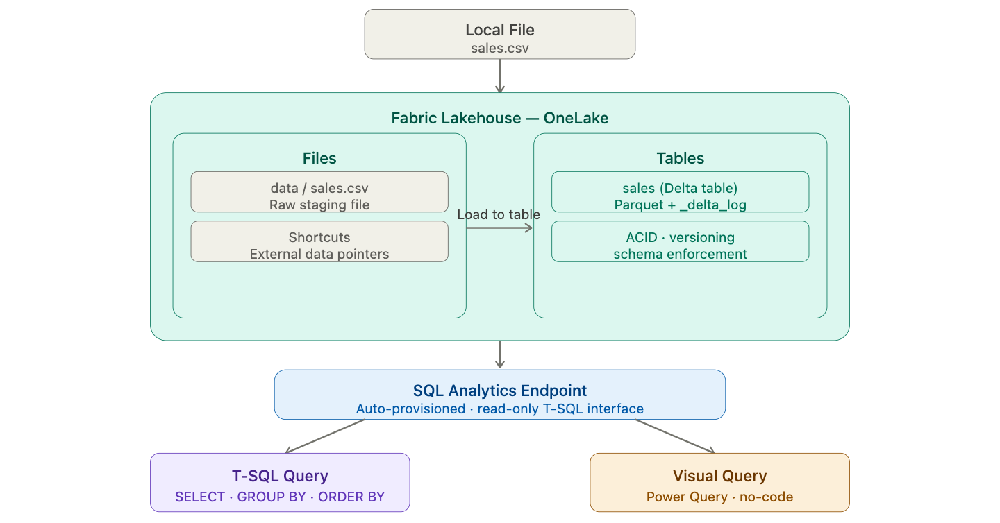
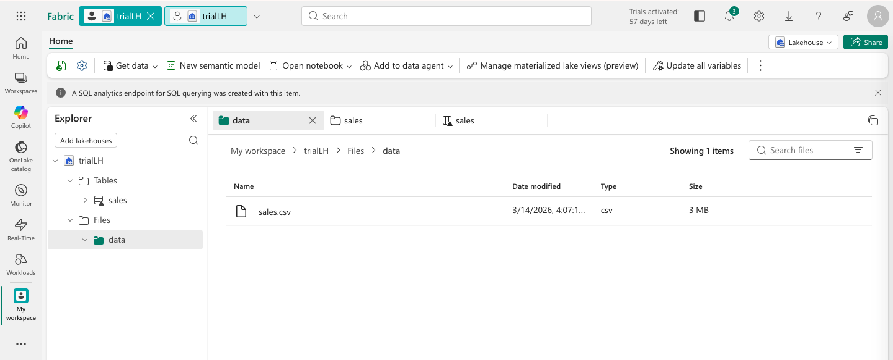
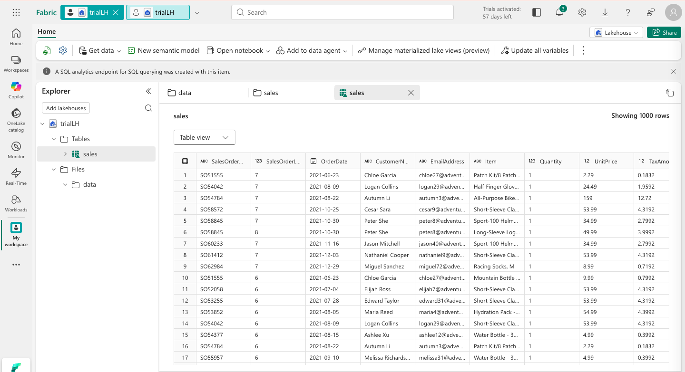
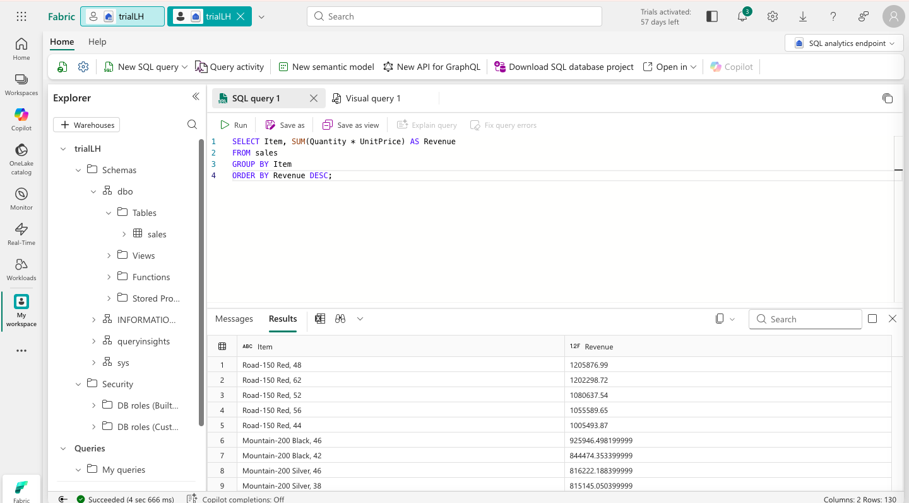
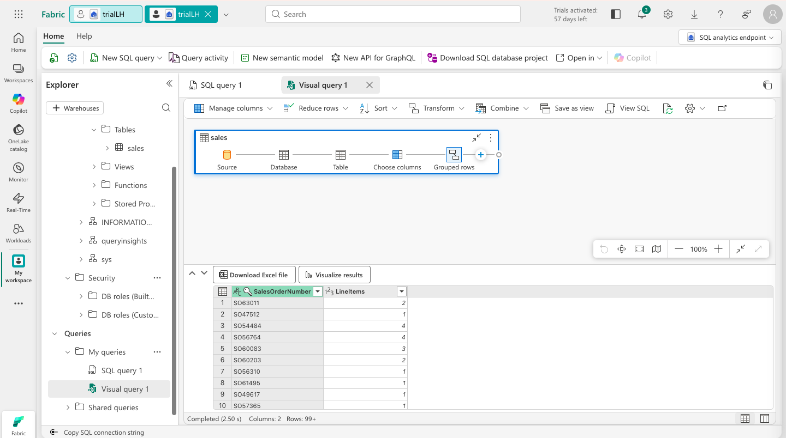

# 🏠 Create a Microsoft Fabric Lakehouse


This lab introduces the **Microsoft Fabric Lakehouse** — creating one from scratch, uploading raw files, converting them into Delta tables, querying with SQL, and exploring data visually with Power Query. It is the foundation everything else in this series builds on.

---

## 🏗️ Architecture

Before diving in, here is the big picture of what we are building.

> 
> *Lakehouse architecture: raw files in OneLake → Delta tables → SQL Analytics Endpoint → T-SQL queries and visual queries.*

### The story of our data

Data warehouses and data lakes have historically been two separate things — and two separate problems. Warehouses gave you fast SQL queries but were rigid and expensive. Lakes gave you cheap, flexible storage but were hard to query and govern. For years, data teams maintained both, moving data between them and accepting the overhead.

**The Lakehouse is the answer to that tension.** It stores data as files in a lake — cheap, scalable, format-agnostic — but applies a relational metadata layer on top, making those files queryable with standard SQL. The underlying format is **Delta Lake**: an open-source table format that adds ACID transactions, schema enforcement, and versioning to ordinary Parquet files.

In Microsoft Fabric, the Lakehouse sits at the centre of everything. Raw files land in the `Files` section — unstructured, unprocessed, exactly as they arrived. From there, they can be loaded into **managed Delta tables** in the `Tables` section, where a SQL Analytics Endpoint automatically makes them queryable. No ETL pipeline required for basic scenarios — just upload, load, and query.

This lab traces that entire journey with a single sales CSV file. By the end, the same data is accessible three ways: as a raw file, as a Delta table queryable with T-SQL, and as a visual query built with Power Query.

```
Local File (sales.csv)
        │
        ▼
  [ Lakehouse Files ]      ← Upload to Files/data/
        │
        ▼
  [ Load to Table ]        ← Convert CSV → Delta table (sales)
        │
        ▼
  [ SQL Analytics Endpoint ]   ← Auto-created, T-SQL queryable
        │              │
        ▼              ▼
  [ SQL Query ]    [ Visual Query ]   ← Two ways to analyse the data
```

---

## ⚙️ Prerequisites

- Access to a **Microsoft Fabric** tenant (Trial, Premium, or Fabric capacity)
- Permissions to create Workspaces and Lakehouses
- A browser with internet access to reach `app.fabric.microsoft.com`

No local tooling or SDK installation is required. All steps are performed within the Fabric web interface.

---

## 🗂️ What Gets Created

```
Fabric Workspace/
└── Lakehouse/
    ├── Files/
    │   └── data/
    │       └── sales.csv          # Raw uploaded file
    └── Tables/
        └── sales                  # Managed Delta table (Parquet + _delta_log)
```

---

## 🚀 The Story, Step by Step

### Chapter 1 — Laying the Foundation: Workspace & Lakehouse

Every analytics solution in Microsoft Fabric starts with two things: a **Workspace** to contain all resources, and a **Lakehouse** to store the data. These are not just administrative containers — they represent a deliberate architectural choice about where data lives and how it is accessed.

The Lakehouse has two distinct sections visible in the Explorer pane. The **Files** folder is the raw storage layer — data lands here as files, exactly as it arrived, with no schema imposed. The **Tables** folder is the structured layer — Delta tables with defined schemas, queryable with SQL. The separation is intentional: it mirrors the Medallion Architecture pattern where raw data and curated data live at different layers of the same system.

1. Navigate to the [Microsoft Fabric portal](https://app.fabric.microsoft.com/home?experience=fabric) and sign in.
2. Select **Workspaces** from the left menu bar and create a new workspace with Fabric capacity enabled (Trial, Premium, or Fabric).
3. From your workspace, select **Create → Lakehouse** (under Data Engineering).
4. Give it a unique name and ensure **Lakehouse schemas (Public Preview)** is **disabled**.
5. Wait for the Lakehouse to be created — the Explorer pane will show empty `Tables` and `Files` folders.

---

### Chapter 2 — Getting Data In: Upload & Shortcuts

The simplest way to get data into a Lakehouse is to upload it directly. No pipeline, no dataflow, no connector — just a file from your local machine. This is perfect for small datasets, prototypes, or one-off analyses where the overhead of a full ingestion pipeline is not justified.

We also explore **shortcuts** — a powerful Fabric feature that lets you reference data stored externally without copying it. A shortcut creates a pointer to data in Azure Data Lake, S3, or other storage systems, making it appear inside the Lakehouse without the cost or risk of duplication. We will not create one in this lab, but understanding that shortcuts exist is important — they are how large organisations avoid copying petabytes of data just to make it queryable in Fabric.

1. Download the source file: `https://raw.githubusercontent.com/MicrosoftLearning/dp-data/main/sales.csv`
   - Open the URL in a new browser tab, right-click anywhere on the page, and select **Save as** to save it as `sales.csv`.
2. In the Lakehouse Explorer, select the **...** menu next to **Files → New subfolder** and create a folder named `data`.
3. Select the **...** menu for the `data` folder and choose **Upload → Upload files**.
4. Upload `sales.csv` and verify it appears under `Files/data/`.
5. Select the file to see a **preview** of its contents.
6. In the **...** menu for the **Files** folder, select **New shortcut** — explore the available data source types, then close the dialog without creating one.

> 
> *sales.csv visible in the Files/data folder — the preview shows raw column data before any transformation.*

---

### Chapter 3 — Giving Data Structure: Load to Delta Table

A CSV file in the Files section is accessible to Spark and PySpark code, but it is not queryable with SQL and it has no schema enforcement. Loading it into a **managed Delta table** changes both of those things.

When we load the CSV into a table, Fabric reads the file, infers or applies a schema, and writes the data in **Parquet format** — a columnar storage format that is faster to read and far more efficient than CSV. It also creates a `_delta_log` subfolder that records every transaction applied to the table. This is the Delta Lake transaction log — the mechanism that gives Delta tables their ACID guarantees and enables time travel queries.

From the moment the table is created, a **SQL Analytics Endpoint** is automatically provisioned. This is a read-only SQL interface that makes every table in the Lakehouse queryable with standard T-SQL — no setup required.

1. In the Explorer pane, select the **...** menu for `sales.csv` and choose **Load to Tables → New table**.
2. Set the table name to `sales` and confirm the load operation. Select **CSV** for the file type.
3. Wait for the table to be created. If it does not appear automatically, refresh **Tables** from the **...** menu.
4. Select the `sales` table to preview the data.
5. Select **... → View files** for the `sales` table to see the underlying Parquet files and `_delta_log` folder.

> 
> *The sales Delta table in the Explorer — data is now stored as Parquet with a transaction log.*

---

### Chapter 4 — Asking Business Questions: SQL Analytics Endpoint

With the table in place, we switch from the Lakehouse view to the **SQL Analytics Endpoint** — a fully functional T-SQL interface that treats the Lakehouse tables as if they were a relational database. No setup, no connection string, no credentials — it is automatically available for every Lakehouse in Fabric.

The query we run answers one of the most fundamental business questions: which products generate the most revenue? This is a simple GROUP BY aggregation, but it demonstrates something important — the same data that was a flat CSV file twenty minutes ago is now answering business questions with standard SQL that any analyst would recognise.

1. At the top-right of the Lakehouse page, switch from **Lakehouse** to **SQL analytics endpoint**.
2. Wait for the SQL endpoint to open in the visual interface.
3. Select **New SQL query** and run the following:

```sql
SELECT Item,
       SUM(Quantity * UnitPrice) AS Revenue
FROM sales
GROUP BY Item
ORDER BY Revenue DESC;
```

4. Select **▷ Run** and review the results — total revenue per product, sorted from highest to lowest.

> 
> *T-SQL query results showing revenue per product — the SQL Analytics Endpoint makes this possible without any additional setup.*

---

### Chapter 5 — The No-Code Path: Visual Query

Not everyone is comfortable with SQL. The **Visual Query** editor brings Power Query's familiar drag-and-drop interface into the Lakehouse, letting analysts build transformations and aggregations without writing a single line of code.

The visual query we build answers a different question: how many line items does each sales order contain? We use a Group By operation to count distinct `SalesOrderLineNumber` values per `SalesOrderNumber`. The result gives a quick sense of order complexity — are most orders single-item, or do customers typically buy multiple things at once?

1. On the toolbar, expand **New SQL query** and select **New visual query**.
2. Drag the `sales` table into the visual query editor.
3. In the **Manage columns** menu, select **Choose columns** and keep only `SalesOrderNumber` and `SalesOrderLineNumber`.
4. In the **Transform** menu, select **Group by** and configure:

   | Setting | Value |
   |---|---|
   | Group by | `SalesOrderNumber` |
   | New column name | `LineItems` |
   | Operation | Count distinct values |
   | Column | `SalesOrderLineNumber` |

5. Review the results — each row shows a sales order and how many distinct line items it contains.

> 
> *Visual query showing line item count per sales order — built entirely with Power Query, no SQL required.*

---

## 🔑 Key Concepts

| Concept | Description |
|---|---|
| **Lakehouse** | A unified analytical store combining data lake file storage with relational table semantics |
| **OneLake** | Fabric's single logical data lake — all Lakehouse Files and Tables are stored here |
| **Delta Lake** | Open-source table format adding ACID transactions, versioning, and schema enforcement to Parquet |
| **Parquet** | A columnar file format used as the physical storage layer for Delta tables |
| **_delta_log** | The transaction log folder that records every write operation — the foundation of Delta's ACID guarantees |
| **SQL Analytics Endpoint** | A read-only T-SQL interface automatically provisioned for every Lakehouse — no setup required |
| **Shortcut** | A pointer to externally stored data that appears inside the Lakehouse without copying it |
| **Visual Query** | A Power Query-based, no-code interface for building transformations and aggregations |
| **Medallion Architecture** | A data design pattern with Bronze (raw), Silver (cleaned), and Gold (curated) layers |

---

## 📸 Screenshots

| File | Description |
|---|---|
| `screenshots/architecture.png` | Architecture diagram showing the end-to-end Lakehouse flow |
| `screenshots/01-file-uploaded.png` | sales.csv in Files/data with preview |
| `screenshots/02-table-created.png` | sales Delta table in Explorer |
| `screenshots/03-sql-query-results.png` | T-SQL revenue query results |
| `screenshots/04visual-query.png` | Visual query showing line item count per order |

---

## 🧹 Clean Up

1. In the left navigation bar, select the icon for your workspace.
2. Select **Workspace settings → General**.
3. Scroll down and select **Remove this workspace → Delete**.

---

## 📚 Resources

- [Microsoft Fabric Documentation](https://learn.microsoft.com/fabric/)
- [Delta Lake Overview](https://delta.io/)
- [Lakehouse in Microsoft Fabric](https://learn.microsoft.com/fabric/data-engineering/lakehouse-overview)
- [SQL Analytics Endpoint](https://learn.microsoft.com/fabric/data-warehouse/get-started-lakehouse-sql-analytics-endpoint)
- [Source Lab (MS Learn)](https://microsoftlearning.github.io/mslearn-fabric/)

---

## 🪪 License

This project is based on lab content from the [Microsoft Learn Fabric repository](https://github.com/MicrosoftLearning/mslearn-fabric).  
© 2025 Microsoft — used for educational purposes.