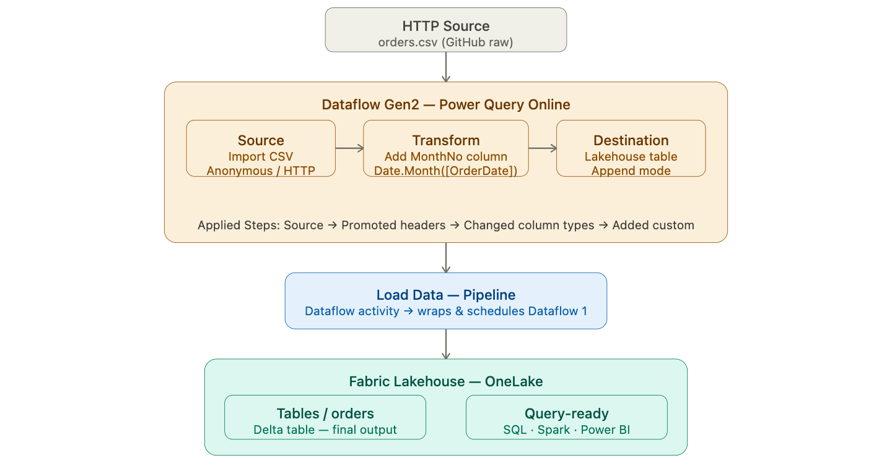
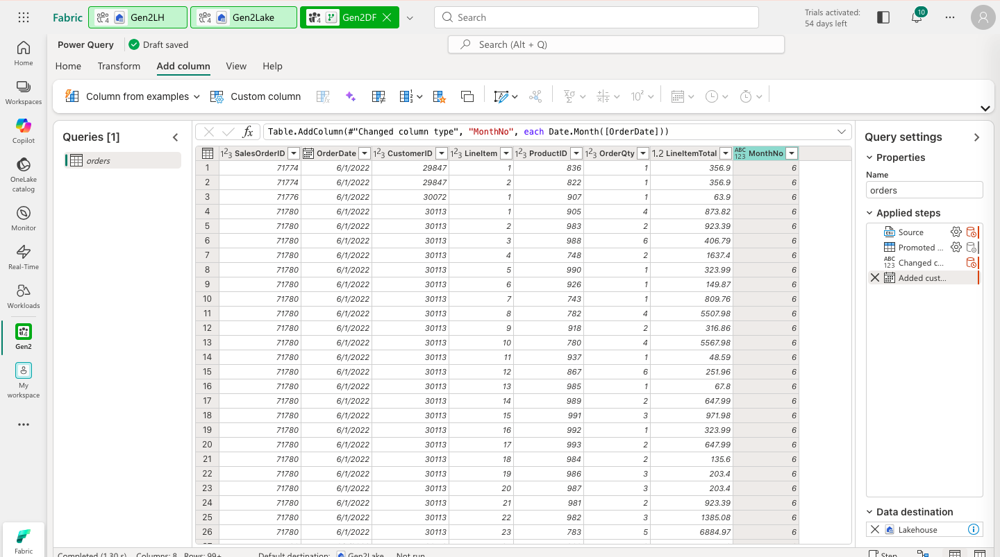
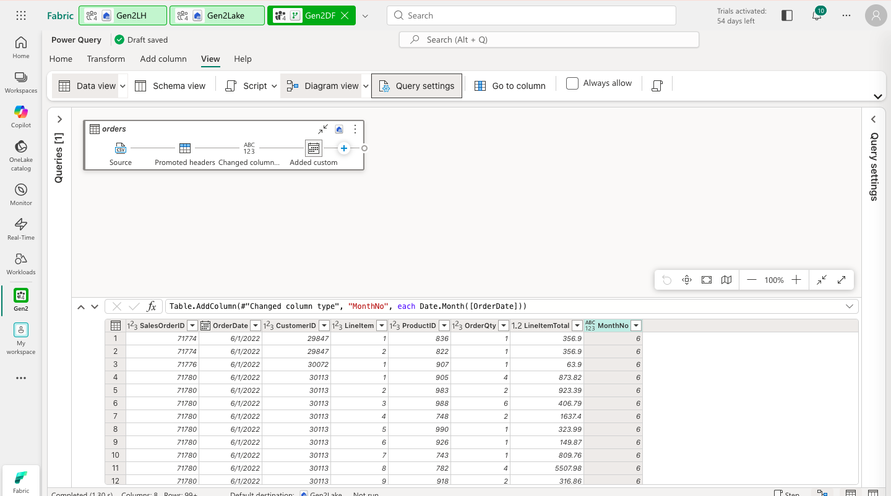
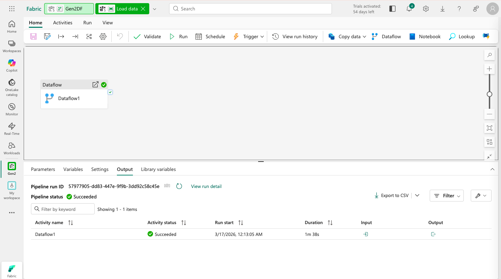
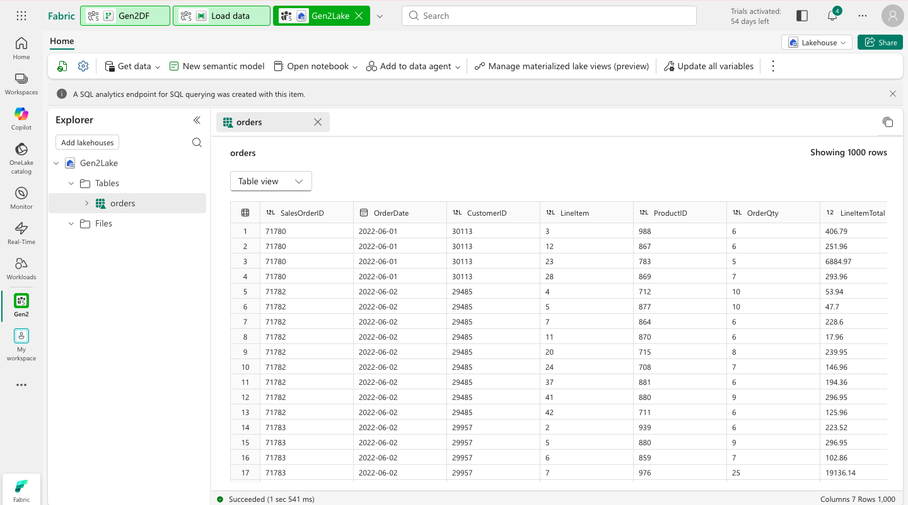

# 📊 Dataflows Gen2 in Microsoft Fabric


This lab walks through building a **no-code ETL pipeline** using Dataflows Gen2 in Microsoft Fabric — connecting to an external CSV source, applying transformations in Power Query Online, and loading the results into a Lakehouse Delta table via a Data Pipeline.

---

## 🏗️ Architecture

Before diving in, here is the big picture of what we are building.

> 
> *End-to-end architecture: HTTP source → Power Query transformations → Pipeline orchestration → Lakehouse Delta table.*

### The story of our data

Not every data transformation needs code. This lab introduces **Dataflows Gen2** — Fabric's answer to the question: *what if analysts could build production-grade ETL pipelines without writing a single line of PySpark or SQL?*

Our source data is a CSV file of order records sitting at a public HTTP URL. The goal is to get it into a Lakehouse as a clean, queryable Delta table — enriched with a derived `MonthNo` column that makes month-based filtering trivial for downstream users.

The **Dataflow** is where all the transformation logic lives. It connects to the CSV, applies changes in a visual editor, and writes directly to a Lakehouse table. Every step is recorded as an **Applied Step** — a replayable, auditable history of what was done to the data. No notebooks, no clusters, no code.

But a dataflow on its own is just a definition. Wrapping it inside a **Pipeline** is what turns it into an operational process — something that can be scheduled, monitored, and chained with other activities. One click to run it, or a schedule to run it automatically — the result is always a fresh `orders` table in the Lakehouse.

```
HTTP Source (orders.csv)
        │
        ▼
  [ Power Query Online ]   ← Add MonthNo, enforce data types
        │
        ▼
  [ Pipeline: Dataflow Activity ]   ← Orchestrate and schedule
        │
        ▼
  Lakehouse Delta Table (orders)   ← Query-ready storage
```

---

## ⚙️ Prerequisites

- Access to a **Microsoft Fabric** tenant (Trial, Premium, or Fabric capacity)
- Permissions to create Workspaces, Lakehouses, Pipelines, and Dataflows
- A browser with internet access to reach `app.fabric.microsoft.com`

No local tooling or SDK installation is required. All steps are performed within the Fabric web interface.

---

## 🗂️ What Gets Created

```
Fabric Workspace/
├── Lakehouse/
│   └── Tables/
│       └── orders               # Final Delta table loaded by the Dataflow
├── Pipelines/
│   └── Load Data                # Pipeline that runs the Dataflow on demand
└── Dataflows/
    └── Dataflow 1               # Power Query Online ETL definition
```

---

## 🚀 The Story, Step by Step

### Chapter 1 — Preparing the Ground: Workspace & Lakehouse

Every Fabric project begins with a workspace and a place to store data. The workspace is the container that holds everything together. The Lakehouse is where our transformed data will ultimately live — not as a raw file, but as a proper Delta table with types, schema, and ACID guarantees.

Unlike Lab 1 where we needed a staging folder for raw files, the Dataflow writes directly to a Lakehouse table. There is no intermediate CSV to manage — the transformation and the write happen in one step inside the Dataflow editor.

1. Navigate to the [Microsoft Fabric portal](https://app.fabric.microsoft.com/home?experience=fabric) and sign in.
2. Select **Workspaces** from the left menu bar and create a new workspace with Fabric capacity enabled.
3. From your workspace, select **Create → Lakehouse** (under Data Engineering).
4. Give it a unique name and ensure **Lakehouse schemas (Public Preview)** is **disabled**.

---

### Chapter 2 — Building the Transformation: Dataflow Gen2

This is the heart of the lab. A Dataflow Gen2 is a Power Query-based ETL component — you define your source, apply transformations visually, and point at a destination. The editor records every change as an **Applied Step**, creating a transparent, replayable audit trail of exactly what was done to the data.

The transformation we apply is simple but meaningful: we extract the month number from the `OrderDate` column using `Date.Month([OrderDate])` and store it as a new `MonthNo` column. This kind of derived attribute — trivial to compute, enormously useful for downstream filtering and aggregation — is exactly what a staging transformation should produce.

1. From the Lakehouse home page, select **Get data → New Dataflow Gen2**.
2. In the **Power Query Online** editor, select **Import from a Text/CSV file** and configure:

   | Setting | Value |
   |---|---|
   | File path or URL | `https://raw.githubusercontent.com/MicrosoftLearning/dp-data/main/orders.csv` |
   | Connection | Create new connection |
   | Data gateway | (none) |
   | Authentication kind | Anonymous |

3. Select **Next** to preview the data, then select **Create**.
4. On the **Add column** tab, select **Custom column** and configure:

   | Setting | Value |
   |---|---|
   | New column name | `MonthNo` |
   | Data type | Whole Number |
   | Formula | `Date.Month([OrderDate])` |

5. Select **OK** and verify `MonthNo` appears in the data preview.
6. Confirm the following data types are correctly set — incorrect types will cause write errors:

   | Column | Required Type |
   |---|---|
   | `OrderDate` | Date |
   | `MonthNo` | Whole Number |

> 
> *Power Query Online showing the MonthNo column and the Applied Steps panel — every transformation is recorded and replayable.*

---

### Chapter 3 — Choosing Where the Data Lands: Destination

A Dataflow without a destination is just a preview. This chapter connects our transformation to the Lakehouse, turning the Dataflow into a complete ETL pipeline that actually writes data somewhere useful.

We choose **Append** mode deliberately. In production, a dataflow often runs on a schedule — daily, hourly, or on-demand. Append mode means each run adds new records to the existing table rather than overwriting it, which is the correct pattern for any incremental ingestion scenario.

1. On the **Home** tab, select **Add data destination → Lakehouse**.
2. Sign in with your Power BI organisational account, then select **Next**.
3. Find your workspace, select your Lakehouse, and specify a new table named `orders`.
4. On the **Choose destination settings** page:
   - Disable **Use automatic settings**
   - Set the update method to **Append**
   - Select **Save settings**
5. Open **View → Diagram view** to confirm the Lakehouse destination icon appears on the query.
6. Select **Save & run** and wait for the Dataflow to complete.

> 
> *Diagram view confirming the Lakehouse destination is linked to the query — the full ETL flow is visible in one screen.*

---

### Chapter 4 — Making It Operational: The Pipeline

A Dataflow defines what to do with data. A Pipeline defines when and how to do it. By wrapping our Dataflow inside a Pipeline activity, we unlock scheduling, monitoring, retry logic, and the ability to chain the Dataflow with other activities in a larger orchestration workflow.

This is a small step in terms of configuration — we are simply adding one activity and pointing it at `Dataflow 1` — but it represents a significant step in maturity. A dataflow run from the editor is a manual act. A dataflow run from a pipeline is an operational process.

1. From your workspace, select **+ New item → Data pipeline** and name it `Load Data`.
2. If the Copy Data wizard opens automatically, close it.
3. On the **Activities** tab, select **Pipeline activity → Dataflow**.
4. With the Dataflow activity selected, open the **Settings** tab:

   | Property | Value |
   |---|---|
   | Dataflow | `Dataflow 1` |

5. Save the pipeline using the **🖫** icon and select **▷ Run**.
6. Wait for the pipeline to complete, then navigate to your Lakehouse.
7. Open the **...** menu on **Tables**, select **Refresh**, and confirm the `orders` table exists with data.

> 
> *Pipeline completed — green checkmark confirms the Dataflow ran successfully and data was written to the Lakehouse.*

> 
> *The orders Delta table populated with transformed data — note the MonthNo column derived from OrderDate.*

---

## 🔄 Transformations Applied

| Transformation | Input | Output | Why |
|---|---|---|---|
| Import CSV | HTTP URL | Raw table in Power Query | Connects to the source data |
| Add `MonthNo` column | `OrderDate` | `MonthNo` (Whole Number) | Enables month-based filtering and aggregation |
| Enforce data types | `OrderDate`, `MonthNo` | Date, Whole Number | Prevents type mismatch errors on write |
| Write to Lakehouse | Transformed table | `orders` Delta table (Append) | Persists data for downstream querying |

---

## 🔑 Key Concepts

| Concept | Description |
|---|---|
| **Dataflow Gen2** | A Fabric component using Power Query Online to define ETL logic without writing code |
| **Power Query Online** | Browser-based transformation tool with a visual editor and 300+ connectors |
| **Applied Steps** | The ordered, replayable list of transformations recorded automatically in Power Query |
| **Lakehouse** | A unified store combining data lake flexibility with warehouse query performance |
| **Delta Lake** | Open-source table format enabling ACID transactions, versioning, and schema enforcement |
| **Append mode** | Write strategy that adds new records without overwriting existing data |
| **Data Pipeline** | Fabric's orchestration layer for scheduling, chaining, and monitoring data activities |

---

## 📸 Screenshots

| File | Description |
|---|---|
| `screenshots/architecture.png` | End-to-end architecture diagram |
| `screenshots/01-power-query-custom-column.png` | Power Query editor with MonthNo column and Applied Steps |
| `screenshots/02-dataflow-diagram-view.png` | Diagram view with Lakehouse destination linked |
| `screenshots/03-dataflow-pipeline-completed.png` | Completed Dataflow pipeline run |
| `screenshots/04-orders-table-preview.png` | orders table preview in the Lakehouse |

---

## 🧹 Clean Up

1. In the left navigation bar, select the icon for your workspace.
2. Select **Workspace settings → General**.
3. Scroll down and select **Remove this workspace → Delete**.

---

## 📚 Resources

- [Microsoft Fabric Documentation](https://learn.microsoft.com/fabric/)
- [Dataflows Gen2 in Microsoft Fabric](https://learn.microsoft.com/fabric/data-factory/dataflows-gen2-overview)
- [Power Query Documentation](https://learn.microsoft.com/power-query/)
- [Delta Lake Overview](https://delta.io/)
- [Source Lab (MS Learn)](https://microsoftlearning.github.io/mslearn-fabric/)

---

## 🪪 License

This project is based on lab content from the [Microsoft Learn Fabric repository](https://github.com/MicrosoftLearning/mslearn-fabric).  
© 2025 Microsoft — used for educational purposes.