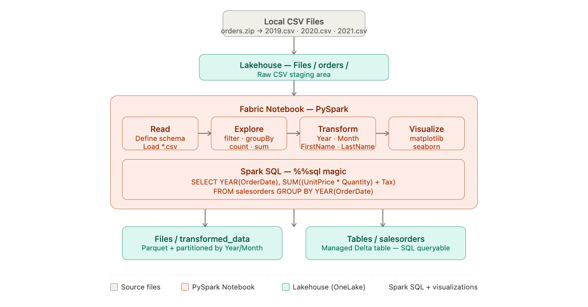
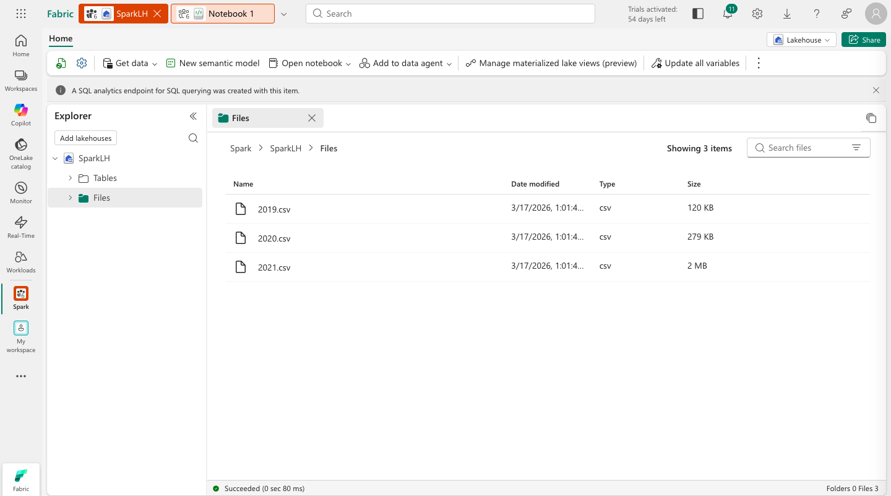
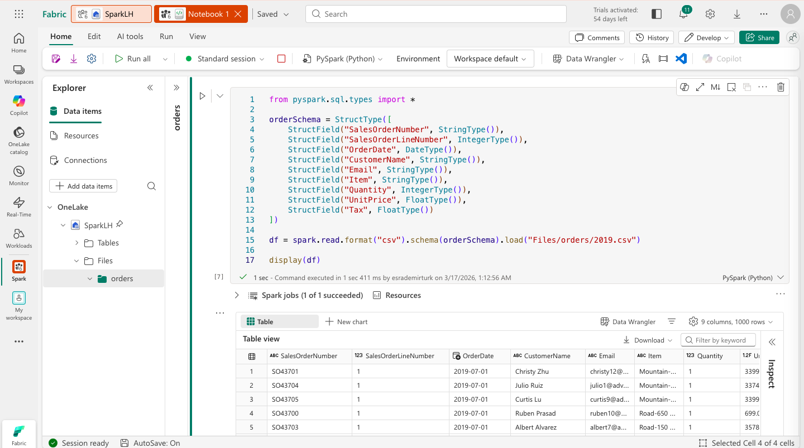
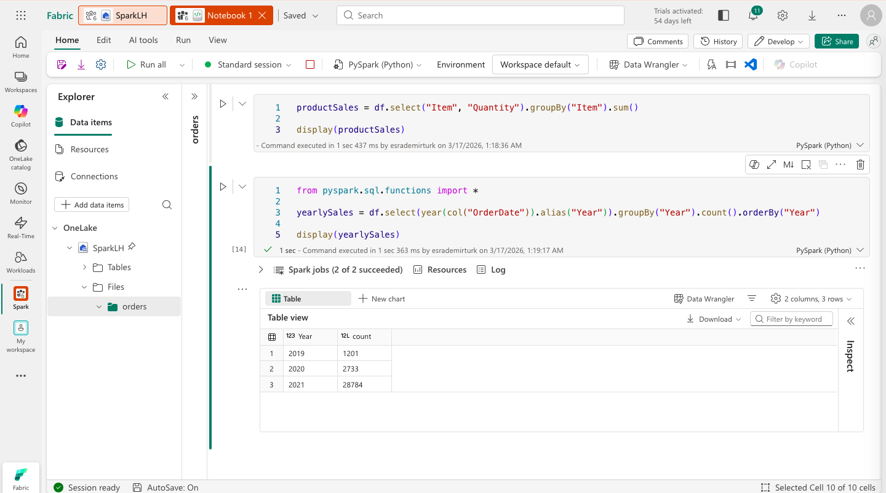
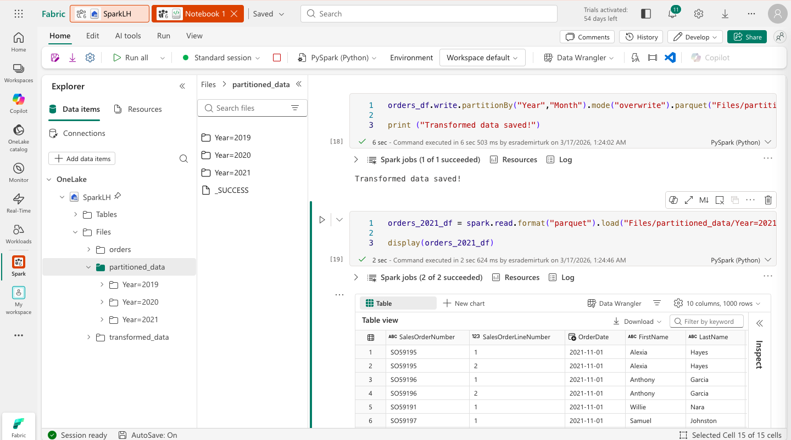
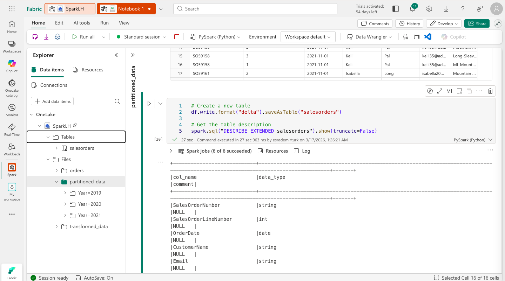
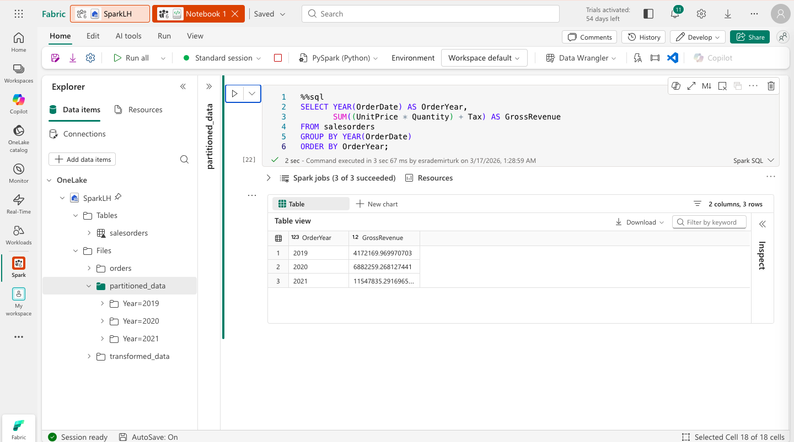
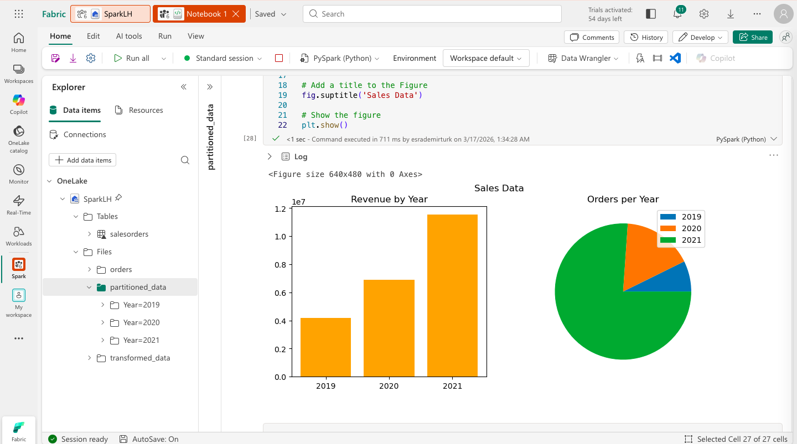
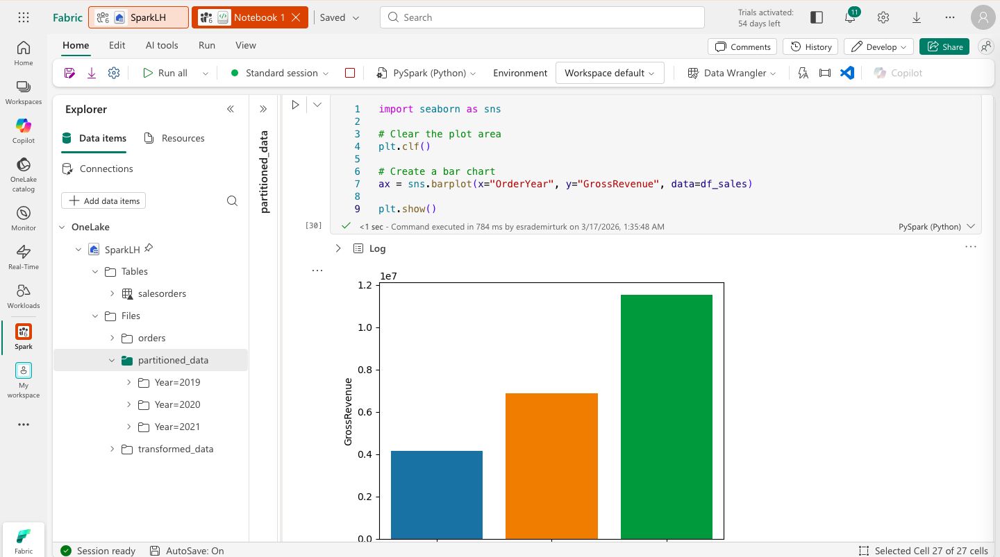

# 🔥 Analyze Data with Apache Spark in Microsoft Fabric


This lab walks through analyzing sales data with **Apache Spark** in Microsoft Fabric — uploading CSV files into a Lakehouse, reading and transforming them with PySpark DataFrames, querying with Spark SQL, and visualizing results with matplotlib and seaborn.

---

## 🏗️ Architecture

Before diving in, here is the big picture of what we are building.

> 
> *End-to-end architecture: CSV files → Lakehouse → PySpark Notebook → Parquet/Delta → Spark SQL → Charts.*

### The story of our data

Previous labs moved data through pipelines and dataflows. This lab is different — here, we roll up our sleeves and work with the data directly using code.

Three years of raw sales records arrive as CSV files: `2019.csv`, `2020.csv`, and `2021.csv`. They are untyped, unstructured, and not queryable. Our job is to turn them into something an analyst can actually use — a clean Delta table with proper column types, derived attributes, and the ability to answer business questions with SQL.

The tool we use is **Apache Spark**, accessed through a **Fabric Notebook** running PySpark. Spark is a distributed compute engine — it can process data at a scale that would overwhelm a single machine. But even on a small dataset like ours, it teaches the patterns that matter: defining schemas explicitly, chaining DataFrame transformations, writing to columnar formats, and querying with SQL.

The journey has four acts. First, we **read** the CSVs into a typed DataFrame — the foundation everything else builds on. Then we **explore** the data using DataFrame methods, asking basic business questions without writing SQL. Next, we **transform** it — adding derived columns, splitting fields, reordering — and save the result as both partitioned Parquet files and a managed Delta table. Finally, we **visualize** the results using matplotlib and seaborn, turning query results into charts that reveal trends at a glance.

```
Local CSV Files (orders.zip)
        │
        ▼
  [ Lakehouse Files ]       ← Upload 2019.csv, 2020.csv, 2021.csv
        │
        ▼
  [ PySpark Notebook ]      ← Read, explore, transform DataFrames
        │              │
        ▼              ▼
  [ Parquet /     [ Delta Table ]   ← Save transformed data
  Partitioned ]   (salesorders)
                       │
                       ▼
               [ Spark SQL ]        ← Query with %%sql magic
                       │
                       ▼
             [ matplotlib / seaborn ] ← Visualize results
```

---

## ⚙️ Prerequisites

- Access to a **Microsoft Fabric** tenant (Trial, Premium, or Fabric capacity)
- Permissions to create Workspaces, Lakehouses, and Notebooks
- A browser with internet access to reach `app.fabric.microsoft.com`

No local tooling or SDK installation is required. All steps are performed within the Fabric web interface.

---

## 🗂️ What Gets Created

```
Fabric Workspace/
├── Lakehouse/
│   ├── Files/
│   │   ├── orders/                  # Uploaded raw CSV files (2019–2021)
│   │   ├── transformed_data/orders/ # Parquet output
│   │   └── partitioned_data/        # Data partitioned by Year and Month
│   └── Tables/
│       └── salesorders              # Managed Delta table
└── Notebooks/
    └── Sales Order Analysis         # PySpark analysis notebook
```

---

## 🚀 The Story, Step by Step

### Chapter 1 — Gathering the Raw Material: Workspace, Lakehouse & Files

Before any analysis can happen, data needs a home. We create a Lakehouse and upload three years of CSV files into it. This is the simplest possible ingestion — no pipeline, no dataflow, just files dropped into a folder. It is enough to get started, and it mirrors a common real-world scenario: a data engineer hands you a set of raw files and asks you to make sense of them.

The Lakehouse's `Files` section is not just for temporary storage — Spark can read directly from it using a simple path like `Files/orders/*.csv`. The wildcard `*` means Spark reads all three files in a single operation, treating them as one logical dataset spanning all three years.

1. Navigate to the [Microsoft Fabric portal](https://app.fabric.microsoft.com/home?experience=fabric-developer) and sign in.
2. Select **Workspaces** from the left menu bar and create a new workspace with Fabric capacity enabled.
3. From your workspace, select **New Item → Lakehouse** and give it a unique name. Ensure **Lakehouse schemas (Public Preview)** is **disabled**.
4. Download the data: `https://github.com/MicrosoftLearning/dp-data/raw/main/orders.zip`
5. Extract the archive — you should have `2019.csv`, `2020.csv`, and `2021.csv` inside an `orders` folder.
6. In the Lakehouse Explorer, select **... → Upload → Upload folder** next to Files and upload the `orders` folder.
7. Verify the three files appear under `Files/orders/`.

> 
> *The orders folder with all three CSV files visible in the Lakehouse Explorer.*

---

### Chapter 2 — Reading the Data Properly: DataFrame & Schema

Reading a CSV with Spark is easy. Reading it correctly is the important part.

By default, Spark infers column types from the data — a process that is convenient but dangerous. An `OrderDate` inferred as a string cannot be used in date calculations. A `Quantity` inferred as a float will produce unexpected results in integer arithmetic. Silently wrong types are worse than explicit errors.

We solve this by defining a **schema** — an explicit declaration of every column name and its type. This is not extra work; it is good engineering practice. The schema acts as a contract between the raw data and everything downstream.

1. From the Lakehouse, select **Open notebook → New notebook** and rename it to `Sales Order Analysis`.
2. Convert the first cell to **markdown** using the **M↓** button and add:

```markdown
# Sales order data exploration
Use this notebook to explore sales order data
```

3. Add a code cell with the schema definition and data load:

```python
from pyspark.sql.types import *

orderSchema = StructType([
    StructField("SalesOrderNumber", StringType()),
    StructField("SalesOrderLineNumber", IntegerType()),
    StructField("OrderDate", DateType()),
    StructField("CustomerName", StringType()),
    StructField("Email", StringType()),
    StructField("Item", StringType()),
    StructField("Quantity", IntegerType()),
    StructField("UnitPrice", FloatType()),
    StructField("Tax", FloatType())
])

df = spark.read.format("csv").schema(orderSchema).load("Files/orders/*.csv")
display(df)
```

4. Select **▷ Run cell**. The first run takes a minute as the Spark pool starts.
5. Verify the output shows correctly typed columns across all three years.

> 
> *DataFrame displaying order data with the defined schema — correct types on every column.*

---

### Chapter 3 — Asking Business Questions: Data Exploration

With a properly typed DataFrame, we can start answering real questions — without writing SQL. Spark's DataFrame API is expressive enough to handle filtering, grouping, counting, and aggregating in just a few lines of code.

The exploration reveals three things: which customers bought a specific product, how much of each product was sold, and how many orders were placed each year. These are the questions any analyst would ask first — and the fact that we can answer them with code rather than SQL queries shows how versatile the DataFrame API is.

**Filter: customers who bought a specific product**
```python
customers = df.select("CustomerName", "Email").where(df['Item'] == 'Road-250 Red, 52')
print(customers.count())
print(customers.distinct().count())
display(customers.distinct())
```

**Aggregate: total quantity sold per product**
```python
productSales = df.select("Item", "Quantity").groupBy("Item").sum()
display(productSales)
```

**Group: number of orders per year**
```python
from pyspark.sql.functions import *

yearlySales = df.select(year(col("OrderDate")).alias("Year")).groupBy("Year").count().orderBy("Year")
display(yearlySales)
```

> 
> *Yearly order counts — the groupBy result showing aggregated sales per year.*

---

### Chapter 4 — Enriching the Data: Transformations & Saving

Raw data rarely arrives in the shape analysts need. Dates need to be decomposed into year and month for time-series analysis. Customer names stored as a single string need to be split for proper sorting and filtering. Irrelevant columns need to be dropped.

We apply all of these transformations in one notebook cell, then save the result in two formats. **Parquet** is a columnar file format — smaller than CSV, faster to read, and supported by every major analytics tool. We also partition the Parquet output by Year and Month, which means a query filtering for a single month only reads that month's file rather than the entire dataset.

```python
from pyspark.sql.functions import *

# Derive Year, Month, FirstName, LastName
transformed_df = df.withColumn("Year", year(col("OrderDate"))) \
                   .withColumn("Month", month(col("OrderDate"))) \
                   .withColumn("FirstName", split(col("CustomerName"), " ").getItem(0)) \
                   .withColumn("LastName", split(col("CustomerName"), " ").getItem(1))

# Select and reorder final columns
transformed_df = transformed_df[
    "SalesOrderNumber", "SalesOrderLineNumber", "OrderDate", "Year", "Month",
    "FirstName", "LastName", "Email", "Item", "Quantity", "UnitPrice", "Tax"
]

display(transformed_df.limit(5))
```

**Save as flat Parquet:**
```python
transformed_df.write.mode("overwrite").parquet('Files/transformed_data/orders')
print("Saved!")
```

**Save as partitioned Parquet:**
```python
transformed_df.write.partitionBy("Year", "Month").mode("overwrite").parquet("Files/partitioned_data")
print("Partitioned!")
```

Refresh the Explorer pane to verify the folder hierarchy: `partitioned_data/Year=2021/Month=1/` etc.

> 
> *Explorer showing the Year/Month partition hierarchy — Spark only reads the relevant partition when filtering by date.*

---

### Chapter 5 — Bridging Code and SQL: Delta Tables

Not everyone speaks PySpark. Registering our transformed data as a managed **Delta table** means analysts, BI tools, and SQL users can query the same data without touching a single line of Python.

Delta format adds something important on top of Parquet: ACID transactions, schema enforcement, and time travel. The table is versioned — every write is logged, and you can query the state of the data at any point in the past. This is the format Fabric recommends for all analytical tables, and it is why we use it here.

```python
df.write.format("delta").saveAsTable("salesorders")
spark.sql("DESCRIBE EXTENDED salesorders").show(truncate=False)
```

Now query it with pure SQL using the `%%sql` magic — no Python required:

```sql
%%sql
SELECT YEAR(OrderDate) AS OrderYear,
       SUM((UnitPrice * Quantity) + Tax) AS GrossRevenue
FROM salesorders
GROUP BY YEAR(OrderDate)
ORDER BY OrderYear;
```

Refresh **Tables** in the Explorer to confirm `salesorders` is visible.

> 
> *The salesorders Delta table in the Lakehouse Explorer — now queryable with SQL, Spark, and Power BI.*

> 
> *Spark SQL results showing gross revenue grouped by year.*

---

### Chapter 6 — Telling the Story: Visualizations

Numbers in a table are hard to interpret. Charts make trends, comparisons, and anomalies immediately obvious. We use two libraries — **matplotlib** for fine-grained control and **seaborn** for a cleaner, theme-based approach — both running directly inside the notebook.

**Bar chart with matplotlib:**
```python
from matplotlib import pyplot as plt

sqlQuery = "SELECT CAST(YEAR(OrderDate) AS CHAR(4)) AS OrderYear, \
                SUM((UnitPrice * Quantity) + Tax) AS GrossRevenue \
            FROM salesorders GROUP BY CAST(YEAR(OrderDate) AS CHAR(4)) ORDER BY OrderYear"
df_spark = spark.sql(sqlQuery)
df_sales = df_spark.toPandas()

plt.clf()
fig = plt.figure(figsize=(8, 3))
plt.bar(x=df_sales['OrderYear'], height=df_sales['GrossRevenue'], color='orange')
plt.title('Revenue by Year')
plt.xlabel('Year')
plt.ylabel('Revenue')
plt.grid(color='#95a5a6', linestyle='--', linewidth=2, axis='y', alpha=0.7)
plt.show()
```

**Line chart with seaborn:**
```python
import seaborn as sns

plt.clf()
sns.set_theme(style="whitegrid")
ax = sns.lineplot(x="OrderYear", y="GrossRevenue", data=df_sales)
plt.show()
```

> 
> *Revenue by year as a bar chart — the orange bars make year-over-year comparison immediate.*

> 
> *The same revenue data as a seaborn line chart — the trend is clearer with a continuous line.*

---

## 🔄 Transformations Applied

| Transformation | Input | Output | Why |
|---|---|---|---|
| Define schema | Raw CSV | Typed DataFrame | Prevents silent type errors |
| Add `Year` column | `OrderDate` | `Year` (Integer) | Enables year-based grouping |
| Add `Month` column | `OrderDate` | `Month` (Integer) | Enables month-based partitioning |
| Split customer name | `CustomerName` | `FirstName`, `LastName` | Normalises name data |
| Save as Parquet | DataFrame | `Files/transformed_data/` | Efficient columnar storage |
| Partition by Year/Month | DataFrame | `Files/partitioned_data/` | Improves query performance |
| Register Delta table | DataFrame | `salesorders` table | Enables SQL and BI access |

---

## 🔑 Key Concepts

| Concept | Description |
|---|---|
| **PySpark** | Python API for Apache Spark — the default language for Fabric notebooks |
| **DataFrame** | Spark's distributed table structure for reading, transforming, and writing data |
| **Schema** | An explicit definition of column names and data types applied when reading files |
| **Parquet** | A columnar file format optimised for analytical queries — faster and smaller than CSV |
| **Partitioning** | Splitting data into subfolders by column value so Spark only reads relevant partitions |
| **Delta Lake** | Open-source table format adding ACID transactions and versioning over Parquet |
| **Spark SQL** | SQL interface for querying Delta tables directly inside a notebook via `%%sql` |
| **matplotlib** | Core Python plotting library for fully customisable chart creation |
| **seaborn** | Higher-level plotting library built on matplotlib with built-in themes |

---

## 📸 Screenshots

| File | Description |
|---|---|
| `screenshots/architecture.png` | End-to-end architecture diagram |
| `screenshots/01-csv-files-uploaded.png` | orders folder with CSV files in Lakehouse Explorer |
| `screenshots/02-dataframe-schema.png` | DataFrame output with defined schema |
| `screenshots/03-data-exploration.png` | Aggregation / groupBy results |
| `screenshots/04-partitioned-data.png` | Partitioned folder hierarchy in Explorer |
| `screenshots/05-delta-table.png` | salesorders table in Lakehouse Explorer |
| `screenshots/06-sql-query-results.png` | Spark SQL revenue query results |
| `screenshots/07-matplotlib-bar-chart.png` | Revenue bar chart from matplotlib |
| `screenshots/08-seaborn-line-chart.png` | Revenue line chart from seaborn |

---

## 🧹 Clean Up

1. On the notebook menu, select **Stop session** to end the Spark session.
2. In the left navigation bar, select the icon for your workspace.
3. Select **Workspace settings → General → Remove this workspace → Delete**.

---

## 📚 Resources

- [Microsoft Fabric Documentation](https://learn.microsoft.com/fabric/)
- [Apache Spark in Microsoft Fabric](https://learn.microsoft.com/fabric/data-engineering/spark-overview)
- [PySpark DataFrame Documentation](https://spark.apache.org/docs/latest/api/python/reference/pyspark.sql/dataframe.html)
- [Delta Lake Overview](https://delta.io/)
- [matplotlib Documentation](https://matplotlib.org/stable/index.html)
- [seaborn Documentation](https://seaborn.pydata.org/)
- [Source Lab (MS Learn)](https://microsoftlearning.github.io/mslearn-fabric/)

---

## 🪪 License

This project is based on lab content from the [Microsoft Learn Fabric repository](https://github.com/MicrosoftLearning/mslearn-fabric).  
© 2025 Microsoft — used for educational purposes.