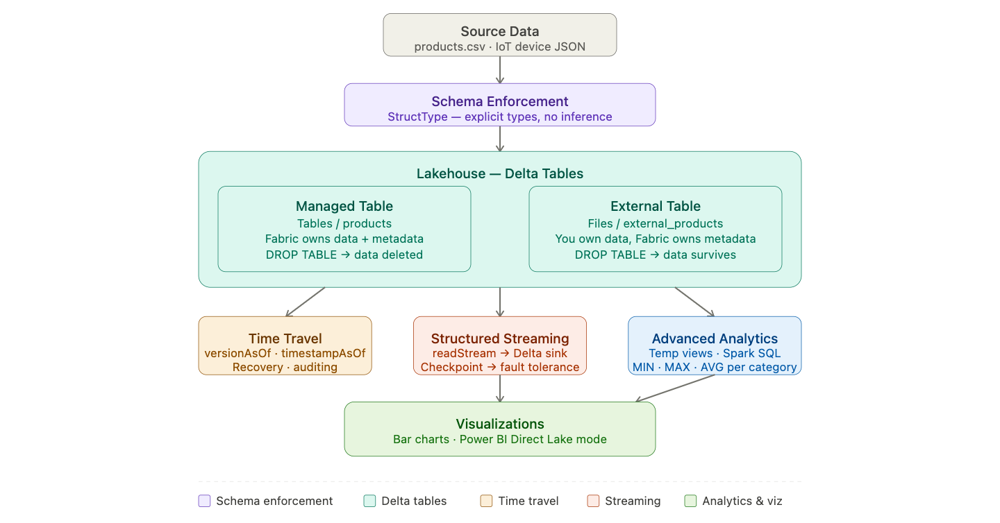
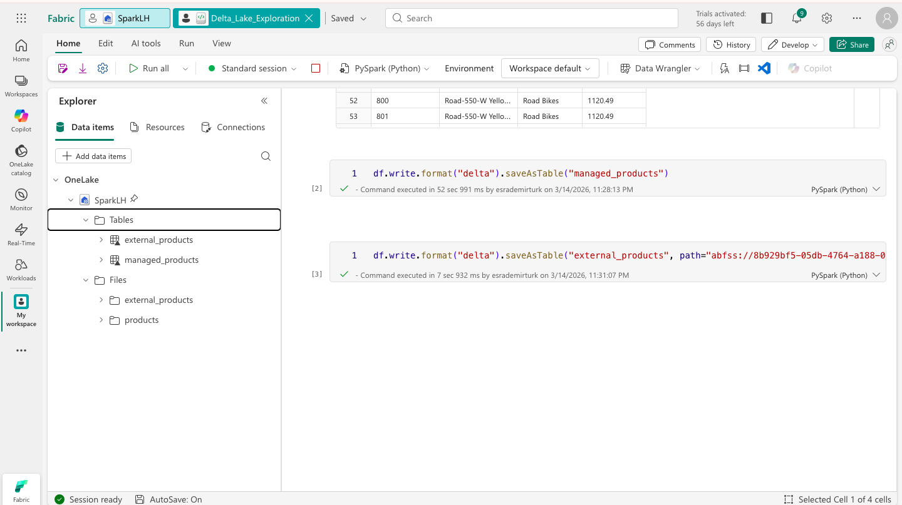
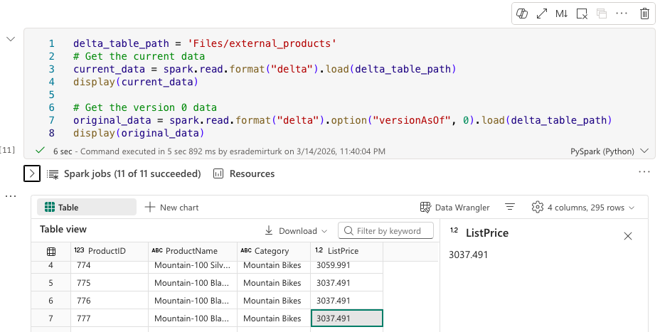
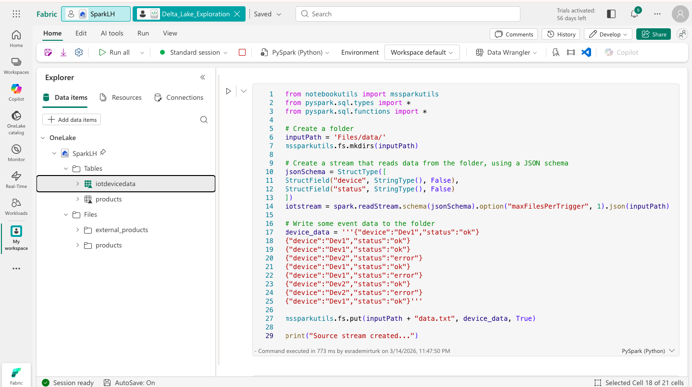
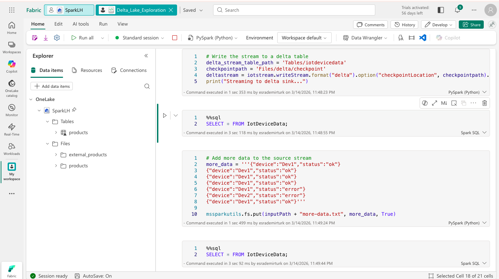
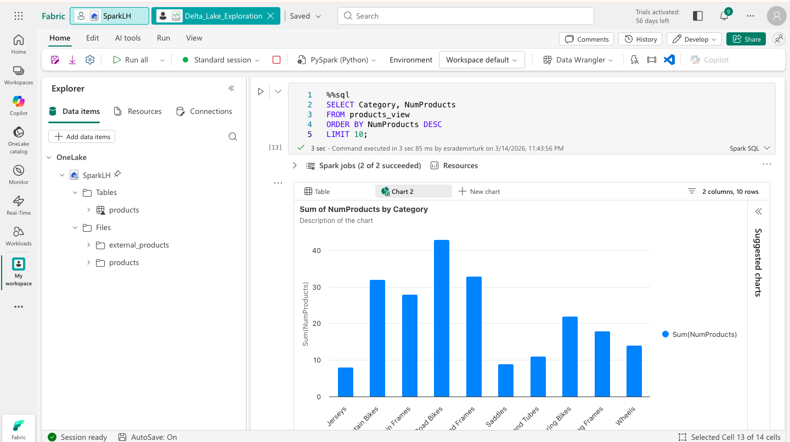

# 🌊 Advanced Data Engineering with Spark & Delta Lake


This lab goes beyond basic data ingestion and explores the **advanced capabilities of Delta Lake** within Microsoft Fabric — schema enforcement, managed vs external tables, time travel, real-time IoT streaming, and complex analytics with visualizations.

---

## 🏗️ Architecture

Before diving in, here is the big picture of what we are building.

> 
> *Advanced Delta Lake architecture: schema-enforced ingestion → managed/external tables → time travel → streaming pipeline → analytics & visualization.*

### The story of our data

Previous labs used Delta Lake as a destination — a place where data lands after being transformed. This lab turns the lens around and asks: *what can Delta Lake do once the data is there?*

The answer is more than most people expect. Delta Lake is not just a storage format. It is a full transactional engine sitting on top of files — one that keeps a complete history of every write, enforces schemas, handles concurrent reads and writes safely, and can even process real-time streaming data into the same tables that batch queries read from.

This lab works through five capabilities in sequence, each building on the last. We start with **schema enforcement** — defining types manually so data is correct from the moment it lands. We explore **managed vs external tables** — a distinction that determines who owns the data and what happens when you drop a table. We use **time travel** to reach back in time and recover data as it existed before an update. We build a **streaming pipeline** that continuously reads IoT device data and writes it to a Delta table. And we run **advanced analytics** with temporary views and visualizations to extract business value from the accumulated data.

```
products.csv
      │
      ▼ (schema-enforced read)
[ PySpark DataFrame ]
      │              │
      ▼              ▼
[ Managed Table ]  [ External Table ]   ← Two ownership models
      │
      ▼
[ Time Travel ]   ← Query any past version
      │
      ▼
[ Streaming Pipeline ]   ← readStream → Delta sink + checkpoint
      │
      ▼
[ Temp Views + SQL ]   ← Advanced aggregations
      │
      ▼
[ Visualizations ]   ← Bar charts from query results
```

---

## ⚙️ Prerequisites

- Access to a **Microsoft Fabric** tenant (Trial, Premium, or Fabric capacity)
- Permissions to create Workspaces, Lakehouses, and Notebooks
- Familiarity with basic PySpark and Delta Lake concepts from earlier labs

---

## 🗂️ What Gets Created

```
Fabric Workspace/
└── Lakehouse/
    ├── Files/
    │   └── external_products/     # External table data (survives DROP TABLE)
    └── Tables/
        ├── products               # Managed Delta table
        └── iot_stream             # Delta sink for streaming data
```

---

## 🚀 The Story, Step by Step

### Chapter 1 — Getting Types Right: Schema Enforcement

Every data pipeline has a silent enemy: **schema drift**. It happens when source data changes — a column gets renamed, a price field that was always an integer suddenly contains decimals, a new column appears without warning. Without schema enforcement, these changes propagate silently into downstream tables, breaking queries and corrupting aggregations in ways that can take days to diagnose.

The solution is simple but requires discipline: define the schema explicitly, every time, rather than letting Spark infer it. When you define a `StructType`, you are writing a contract. Any data that violates it — wrong type, missing required column — will fail at read time with a clear error, not silently corrupt a table hours later.

```python
from pyspark.sql.types import *

productSchema = StructType([
    StructField("ProductID", IntegerType()),
    StructField("ProductName", StringType()),
    StructField("Category", StringType()),
    StructField("ListPrice", DoubleType())
])

df = spark.read.format("csv") \
    .option("header", True) \
    .schema(productSchema) \
    .load("Files/products.csv")

display(df)
```

The `ListPrice` column is defined as `DoubleType` — not a string, not inferred. Every downstream calculation that multiplies or aggregates this column will work correctly because the type is guaranteed at ingestion, not assumed.

---

### Chapter 2 — Who Owns the Data? Managed vs External Tables

This is one of the most important — and most misunderstood — distinctions in data lake architecture. When you create a **managed table**, Fabric owns both the metadata and the data files. Drop the table, and both disappear. When you create an **external table**, Fabric only owns the metadata. The data files live wherever you specified — and dropping the table leaves them untouched.

Why does this matter? In a multi-engine environment — where Spark, SQL Server, Databricks, and other systems might all be reading from the same underlying storage — you cannot afford to have one engine delete data that another engine depends on. External tables give you the ability to register data in Fabric's metastore for SQL access, while keeping the actual files under your own management and control.

**Create a managed table:**
```python
df.write.format("delta").saveAsTable("products")
```

**Create an external table (data lives in Files, not Tables):**
```python
df.write.format("delta").saveAsTable("products_external",
    path="Files/external_products")
```

**The key test — drop the external table and verify the files survive:**
```python
spark.sql("DROP TABLE products_external")
# Navigate to Files/external_products/ — Parquet files are still there
```

> 
> *Table properties showing the location difference — managed tables point to /Tables/, external tables point to /Files/ and survive a DROP TABLE.*

---

### Chapter 3 — Reaching Back in Time: Time Travel

Every write to a Delta table is logged in the `_delta_log` folder. This is not just for auditing — it means you can query the table as it existed at any point in the past. Accidentally ran a mass update with the wrong WHERE clause? Time travel gets your data back. Need to audit what a report showed last quarter? Time travel shows you exactly what the table contained on that date.

We demonstrate this by applying a 10% price increase to all Mountain Bikes — a realistic scenario — and then using time travel to retrieve the original prices as they existed before the update.

**Apply the update:**
```python
from delta.tables import DeltaTable

deltaTable = DeltaTable.forPath(spark, "Tables/products")
deltaTable.update(
    condition = "Category = 'Mountain Bikes'",
    set = {"ListPrice": "ListPrice * 1.1"}
)
```

**Query version 0 — the state before the update:**
```python
df_original = spark.read.format("delta") \
    .option("versionAsOf", 0) \
    .load("Tables/products")

display(df_original)
```

**Or query by timestamp:**
```python
df_historical = spark.read.format("delta") \
    .option("timestampAsOf", "2024-01-01") \
    .load("Tables/products")
```

> 
> *Version 0 of the products table — original prices before the Mountain Bikes update, retrieved via time travel.*

---

### Chapter 4 — Processing Data as It Arrives: Structured Streaming

Batch processing is powerful, but some data cannot wait. IoT sensors, transaction logs, clickstreams, and telemetry data are generated continuously — and decisions based on that data need to be made in near real-time.

**Structured Streaming** in Spark extends the same DataFrame API to handle continuous data. Instead of reading a fixed file, you `readStream` from a folder that Spark monitors for new files. Instead of writing once, you `writeStream` continuously to a Delta table. The key to reliability is **checkpointing** — a folder where Spark records exactly how far it has processed the stream. If the stream fails and restarts, it picks up exactly where it left off. No data is lost, no data is processed twice.

**Simulate the IoT data source:**
```python
import json
from notebookutils import mssparkutils

# Write sample IoT device status files to the streaming source folder
iot_data = [
    {"device": "Dev1", "status": "ok", "temp": 23.5},
    {"device": "Dev2", "status": "alert", "temp": 41.2}
]

mssparkutils.fs.put("Files/iot_stream/data1.json",
    "\n".join([json.dumps(d) for d in iot_data]), True)
```

**Define the streaming read and write:**
```python
from pyspark.sql.types import *
from pyspark.sql.functions import *

iotSchema = StructType([
    StructField("device", StringType()),
    StructField("status", StringType()),
    StructField("temp", DoubleType())
])

stream = spark.readStream \
    .format("json") \
    .schema(iotSchema) \
    .load("Files/iot_stream/")

query = stream.writeStream \
    .format("delta") \
    .option("checkpointLocation", "Files/iot_checkpoint") \
    .outputMode("append") \
    .table("iot_stream")

query.awaitTermination(60)
```

> 
> *Streaming pipeline running — new IoT records arriving in the Delta sink as files are added to the source folder.*

> 
> *The iot_stream Delta table populated with device status data from the streaming pipeline.*

---

### Chapter 5 — Extracting Business Value: Analytics & Visualization

With clean, versioned, streaming-capable data in Delta tables, the final step is answering the business questions that motivated all this engineering work. We create **temporary views** — named shortcuts to complex queries — that let us express multi-step aggregations in readable, composable SQL.

The aggregation we compute — minimum, maximum, and average price per product category — is a classic analytical pattern. It immediately reveals which categories are budget-friendly, which are premium, and how much price variation exists within each. The bar chart turns those numbers into something a business stakeholder can interpret in seconds.

**Create a temporary view and aggregate:**
```python
df = spark.sql("SELECT * FROM products")
df.createOrReplaceTempView("products_view")
```

```sql
%%sql
SELECT Category,
       MIN(ListPrice) AS MinPrice,
       MAX(ListPrice) AS MaxPrice,
       AVG(ListPrice) AS AvgPrice
FROM products_view
GROUP BY Category
ORDER BY AvgPrice DESC;
```

**Visualize the results:**

In the query results pane, select **+ New chart** and configure a bar chart with Category on the X-axis and AvgPrice on the Y-axis to turn the aggregation into an immediately readable visual.

> 
> *Price range per category — min, max, and average prices displayed as a bar chart from the SQL aggregation.*

---

## 🔑 Key Concepts

| Concept | Description |
|---|---|
| **Schema enforcement** | Explicitly defining column types at read time — prevents silent schema drift in production |
| **Managed table** | Fabric owns both metadata and data — dropping the table deletes both |
| **External table** | Fabric owns only metadata — data files survive a DROP TABLE |
| **_delta_log** | The transaction log folder recording every write — the foundation of time travel and ACID guarantees |
| **Time travel** | Querying a Delta table as it existed at any past version or timestamp |
| **Structured Streaming** | Spark's continuous processing model — same DataFrame API, applied to real-time data |
| **Checkpoint** | A folder recording stream progress — guarantees exactly-once processing on restart |
| **Temporary view** | A named alias for a DataFrame or query result — scoped to the current Spark session |
| **Direct Lake mode** | Power BI reads Delta tables directly from OneLake — no data movement or import required |

---

## 📸 Screenshots

| File | Description |
|---|---|
| `screenshots/architecture.png` | End-to-end architecture diagram |
| `screenshots/01-managed-external-tables.png` | Table properties showing managed vs external location difference |
| `screenshots/02-data-versioning.png` | Time travel results — version 0 of products before update |
| `screenshots/03streaming.png` | Streaming pipeline running with IoT data |
| `screenshots/04streaming-2.png` | iot_stream Delta table populated with streaming data |
| `screenshots/05-visualization.png` | Price range bar chart from SQL aggregation |

---

## 🧹 Clean Up

1. On the notebook menu, select **Stop session** to end the Spark session.
2. In the left navigation bar, select the icon for your workspace.
3. Select **Workspace settings → General → Remove this workspace → Delete**.

---

## 📚 Resources

- [Microsoft Fabric Documentation](https://learn.microsoft.com/fabric/)
- [Delta Lake Time Travel](https://docs.delta.io/latest/delta-batch.html#query-an-older-snapshot-of-a-table-time-travel)
- [Structured Streaming in Spark](https://spark.apache.org/docs/latest/structured-streaming-programming-guide.html)
- [Delta Lake Overview](https://delta.io/)
- [Source Lab (MS Learn)](https://microsoftlearning.github.io/mslearn-fabric/)

---

## 🪪 License

This project is based on lab content from the [Microsoft Learn Fabric repository](https://github.com/MicrosoftLearning/mslearn-fabric).  
© 2025 Microsoft — used for educational purposes.