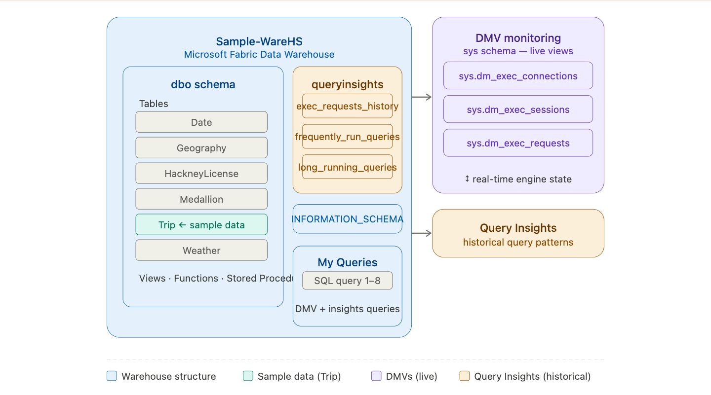
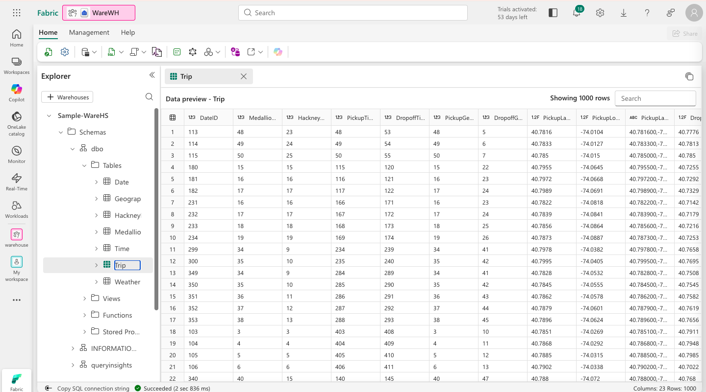
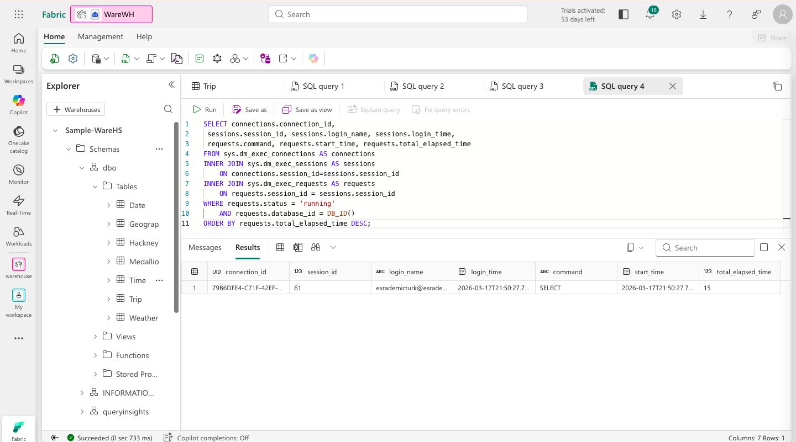
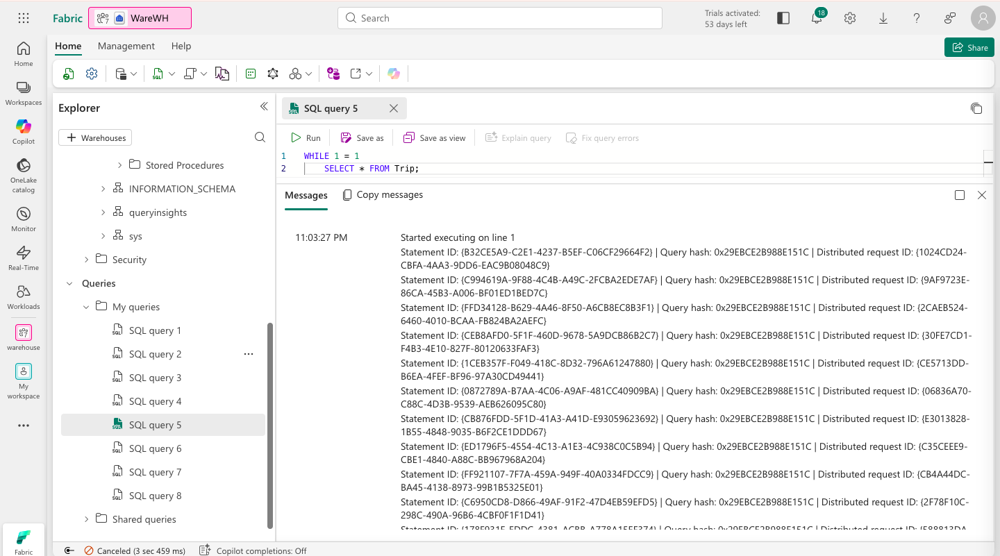
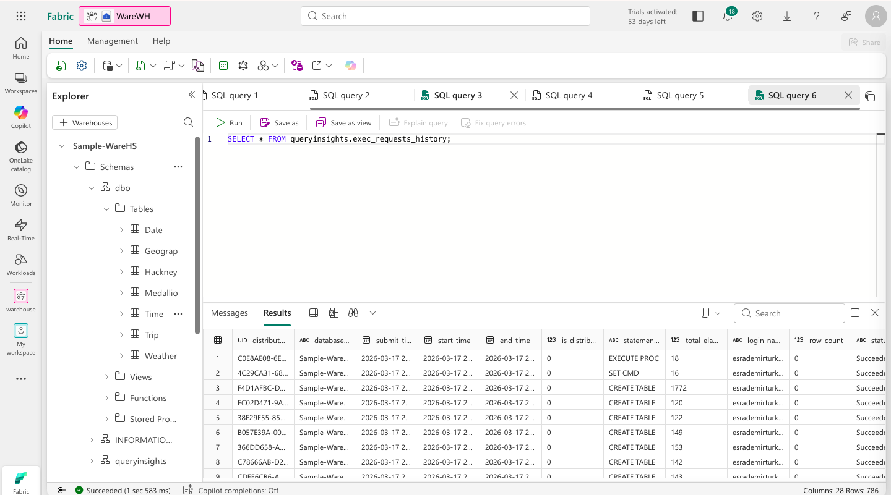
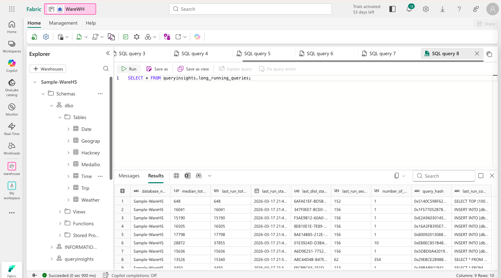

# 🔍 Monitor a Data Warehouse in Microsoft Fabric


This lab explores **monitoring capabilities** in Microsoft Fabric data warehouses — using Dynamic Management Views (DMVs) to observe live connections, sessions, and running queries, and Query Insights to analyse historical query performance.

---

## 🏗️ Architecture

Before diving in, here is the big picture of what we are observing.

> 
> *Monitoring architecture: DMVs expose live activity inside the warehouse engine, while Query Insights surfaces historical query patterns across the queryinsights schema.*

### The story of observability

Every production data system eventually asks the same question: *what is actually happening inside this thing right now?*

A data warehouse can be handling dozens of simultaneous connections, each running queries of varying complexity and duration. Without visibility into this activity, performance problems are invisible until they become outages — a slow query quietly consuming resources, a runaway loop locking tables, a session sitting idle for hours.

Microsoft Fabric addresses this with two complementary tools that work at different time horizons.

The first is **Dynamic Management Views (DMVs)** — a set of system views (`sys.dm_exec_connections`, `sys.dm_exec_sessions`, `sys.dm_exec_requests`) that expose the live internal state of the warehouse engine. They are a window into the present moment: every active connection, every authenticated session, every query currently executing. DMVs are the diagnostic tool you reach for when something feels slow right now.

The second is **Query Insights** — a schema of views (`queryinsights.exec_requests_history`, `queryinsights.frequently_run_queries`, `queryinsights.long_running_queries`) that record and aggregate historical query data. They answer different questions: what queries run most often? Which queries consistently take the longest? Query Insights is the tool you use to understand patterns over time, not just the current snapshot.

Together, they give engineers and analysts a complete picture — live diagnostics and historical analysis — without needing any external monitoring infrastructure.

```
Microsoft Fabric Data Warehouse (sample-dw)
              │
    ┌─────────┴──────────┐
    │                    │
    ▼                    ▼
[ DMVs ]          [ Query Insights ]
sys.dm_exec_       queryinsights.
  connections        exec_requests_history
  sessions           frequently_run_queries
  requests           long_running_queries
    │                    │
    ▼                    ▼
Live activity        Historical patterns
(right now)          (over time)
```

---

## ⚙️ Prerequisites

- Access to a **Microsoft Fabric** tenant (Trial, Premium, or Fabric capacity)
- Permissions to create Workspaces and Warehouses
- A browser with internet access to reach `app.fabric.microsoft.com`

No local tooling or SDK installation is required. All steps are performed within the Fabric web interface.

---

## 🗂️ What Gets Created

```
Fabric Workspace/
└── Warehouse/
    └── sample-dw                  # Pre-populated sample warehouse
        ├── Schemas/
        │   ├── sys/               # DMV views (dm_exec_connections, etc.)
        │   └── queryinsights/     # Historical query views
        └── Tables/
            └── Trip               # Sample taxi ride data
```

---

## 🚀 The Story, Step by Step

### Chapter 1 — Setting the Scene: Workspace & Sample Warehouse

Every monitoring story starts with something to monitor. Rather than building a warehouse from scratch, this lab uses Fabric's **Sample warehouse** feature — a pre-populated warehouse filled with taxi ride data. This lets us skip the ingestion setup and go straight to the interesting part: watching the engine work.

The sample warehouse matters because it gives us real tables with real data. When we run queries against it, we generate actual load — connections, sessions, requests — that the DMVs will reflect. An empty warehouse would give us nothing to observe.

1. Navigate to the [Microsoft Fabric portal](https://app.fabric.microsoft.com/home?experience=fabric) and sign in.
2. Select **Workspaces** from the left menu bar and create a new workspace with Fabric capacity enabled.
3. From your workspace, select **Create → Sample warehouse** (under Data Warehouse).
4. Name it `sample-dw` and wait for it to be created and populated with sample data.
5. Verify the warehouse opens with tables visible — this is the taxi ride analysis dataset we will be monitoring.

> **Screenshot placeholder**
> 
> *The sample-dw warehouse freshly created and populated with taxi ride sample data.*

---

### Chapter 2 — Looking Through the Window: Dynamic Management Views

DMVs are one of the most powerful — and underused — features in any SQL-based system. They feel like ordinary tables you can `SELECT` from, but they are actually live views into the engine's internal state. Querying them is like looking through a one-way mirror into the warehouse's operating room.

We start with three foundational DMVs, each revealing a different layer of activity. **Connections** are the lowest level — the raw TCP sessions between clients and the warehouse. **Sessions** are authenticated identities on top of those connections — a login, a user, a time. **Requests** are the actual work happening — the SQL commands currently executing inside those sessions. Understanding the relationship between these three layers is fundamental to diagnosing any performance issue in a production system.

**Query 1 — Who is connected?**
```sql
SELECT * FROM sys.dm_exec_connections;
```
Run this and examine the results. Each row is an active connection to the warehouse — note the connection ID, client address, and connection time.

**Query 2 — Who is authenticated?**
```sql
SELECT * FROM sys.dm_exec_sessions;
```
Each row here is an authenticated session — note the login name, session ID, and login time. One connection can have one session; the session is the identity layer on top of the raw connection.

**Query 3 — What is running right now?**
```sql
SELECT * FROM sys.dm_exec_requests;
```
Each row is an actively executing request. When the warehouse is idle, this returns very few rows. When it is under load, you will see every query in flight.

**Query 4 — The full picture joined together:**

The real power comes from joining all three DMVs. This query shows only the queries currently running in the current database, ordered by how long they have been running:

```sql
SELECT connections.connection_id,
    sessions.session_id, sessions.login_name, sessions.login_time,
    requests.command, requests.start_time, requests.total_elapsed_time
FROM sys.dm_exec_connections AS connections
INNER JOIN sys.dm_exec_sessions AS sessions
    ON connections.session_id = sessions.session_id
INNER JOIN sys.dm_exec_requests AS requests
    ON requests.session_id = sessions.session_id
WHERE requests.status = 'running'
    AND requests.database_id = DB_ID()
ORDER BY requests.total_elapsed_time DESC;
```

> **Screenshot placeholder**
> 
> *The joined DMV query — each row shows a running request with its connection, session, login, and elapsed time.*

---

### Chapter 3 — Creating Something to Observe: The Infinite Loop

A monitoring tool is only interesting when there is something to monitor. To see the DMVs in action, we deliberately create load — a query designed to run forever — and then watch the DMVs detect it in real time.

This is not just a lab trick. In production, runaway queries look exactly like this: a `WHILE 1=1` might be an accidental infinite loop in application code, or a long-running analytical job that is consuming warehouse resources. The skill of spotting these queries in DMVs and understanding their elapsed time is genuinely useful for any data engineer or DBA.

1. In the **New SQL query** dropdown, open a **second query tab**.
2. In the new tab, run this infinite loop:

```sql
WHILE 1 = 1
    SELECT * FROM Trip;
```

3. Leave this query running and **switch back to the first tab** (the DMV query tab).
4. Re-run the joined DMV query. This time the infinite loop should appear as a row in the results — note its `total_elapsed_time`.
5. Wait a few seconds and run the DMV query again. The elapsed time for the loop query should have increased.
6. Switch to the second tab and select **Cancel** to stop the infinite loop.
7. Return to the first tab and run the DMV query one final time — confirm the loop query has disappeared from the results.

> **Screenshot placeholder**
> 
> *The DMV query results showing the infinite loop as a running request — note the total_elapsed_time increasing between runs.*

---

### Chapter 4 — Learning from the Past: Query Insights

DMVs are excellent for live diagnostics, but they only show what is happening right now. The moment a query finishes, it disappears from `sys.dm_exec_requests`. This is where **Query Insights** fills the gap — it persists query history so we can analyse patterns over time.

This matters enormously in practice. A query that always takes 30 seconds is a problem, but you might only notice it if you happen to be looking at DMVs at the right moment. Query Insights shows you the same query appearing in `long_running_queries` again and again, making the pattern undeniable. Similarly, `frequently_run_queries` can reveal queries that individually are fast but collectively are hammering the warehouse thousands of times per hour.

Close all query tabs from the previous chapter, then open a **new SQL query tab** and work through the three Query Insights views:

**View 1 — Full query history:**
```sql
SELECT * FROM queryinsights.exec_requests_history;
```
This returns every query that has been executed in the warehouse, including its start time, duration, and status. You should see the queries we ran in earlier chapters.

**View 2 — Most frequently run queries:**
```sql
SELECT * FROM queryinsights.frequently_run_queries;
```
Aggregated by query text, this view surfaces which queries are run most often. In production, this helps identify candidates for caching or materialised views.

**View 3 — Longest running queries:**
```sql
SELECT * FROM queryinsights.long_running_queries;
```
This view surfaces queries by duration — the ones that consistently take the most time. These are the first candidates for query optimisation, index tuning, or partitioning work.

> **Screenshot placeholder**
> 
> *Query history from exec_requests_history — showing previously executed queries with their durations.*

> **Screenshot placeholder**
> 
> *long_running_queries view — the infinite loop query from Chapter 3 should appear here as the longest running query.*

---

## 🔑 Key Concepts

| Concept | Description |
|---|---|
| **Dynamic Management Views (DMVs)** | System views that expose the live internal state of the warehouse engine — connections, sessions, and active requests |
| **sys.dm_exec_connections** | DMV showing all active TCP connections to the warehouse |
| **sys.dm_exec_sessions** | DMV showing all authenticated sessions — the identity layer on top of connections |
| **sys.dm_exec_requests** | DMV showing all currently executing SQL requests — disappears when the query finishes |
| **Query Insights** | A schema of views that persist and aggregate historical query data for pattern analysis |
| **exec_requests_history** | Query Insights view showing all previously executed queries with durations and status |
| **frequently_run_queries** | Query Insights view aggregated by query text — reveals high-frequency query patterns |
| **long_running_queries** | Query Insights view sorted by duration — surfaces chronic performance bottlenecks |
| **DB_ID()** | T-SQL function returning the current database ID — used to filter DMV results to the current warehouse |
| **total_elapsed_time** | The cumulative execution time of a request in milliseconds — key metric for identifying runaway queries |

---

## 📸 Screenshots

Create a `screenshots/` folder at the root of this repository and add the following images:

| File | Description |
|---|---|
| `screenshots/architecture.png` | Your architecture diagram showing DMVs and Query Insights |
| `screenshots/01-sample-warehouse.png` | The sample-dw warehouse freshly created with sample data |
| `screenshots/02-dmv-join-results.png` | Joined DMV query showing running requests |
| `screenshots/03-infinite-loop-dmv.png` | DMV results capturing the infinite loop query in flight |
| `screenshots/04-exec-requests-history.png` | exec_requests_history showing query history |
| `screenshots/05-long-running-queries.png` | long_running_queries view with the loop query visible |

---

## 🧹 Clean Up

To remove all resources after completing the lab:

1. In the left navigation bar, select the icon for your workspace.
2. Select **Workspace settings → General**.
3. Scroll down and select **Remove this workspace → Delete**.

---

## 📚 Resources

- [Microsoft Fabric Documentation](https://learn.microsoft.com/fabric/)
- [Monitor connections, sessions and requests using DMVs](https://learn.microsoft.com/fabric/data-warehouse/monitor-using-dmv)
- [Query Insights in Fabric data warehousing](https://learn.microsoft.com/fabric/data-warehouse/query-insights)
- [T-SQL DMV Reference](https://learn.microsoft.com/sql/relational-databases/system-dynamic-management-views/system-dynamic-management-views)
- [Source Lab (MS Learn)](https://microsoftlearning.github.io/mslearn-fabric/)

---

## 🪪 License

This project is based on lab content from the [Microsoft Learn Fabric repository](https://github.com/MicrosoftLearning/mslearn-fabric).  
© 2025 Microsoft — used for educational purposes.