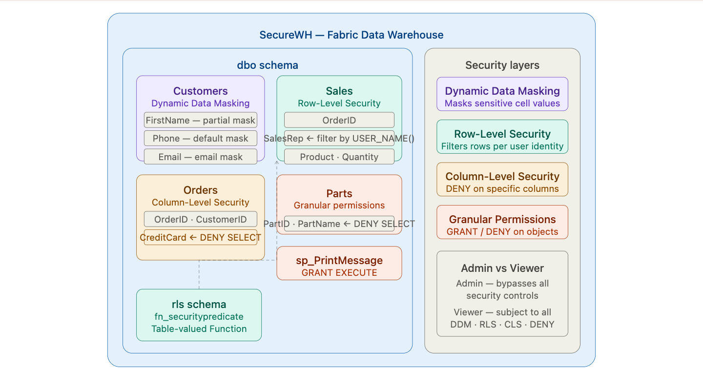
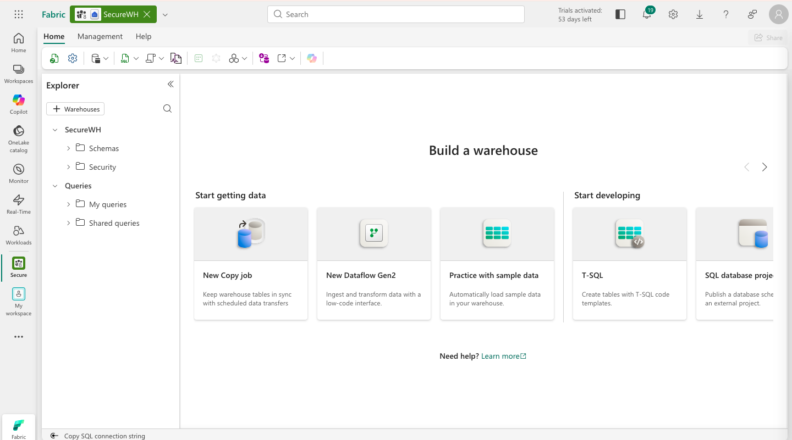
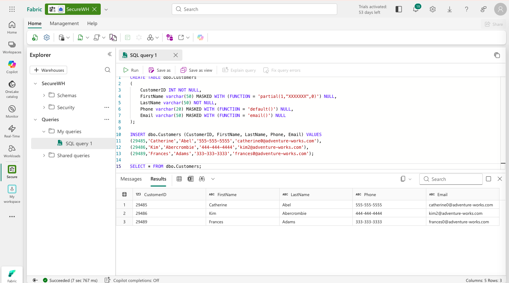
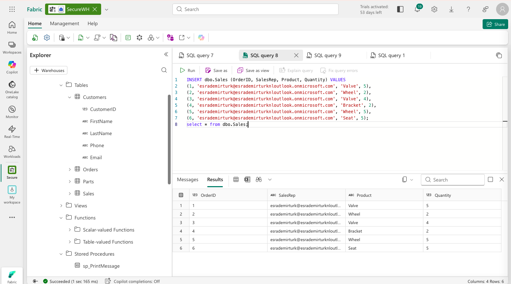
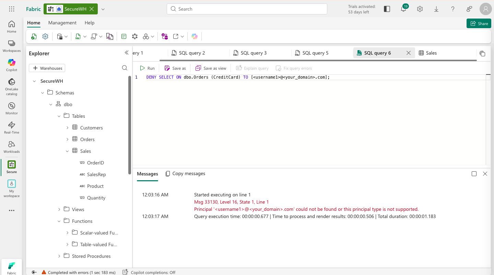
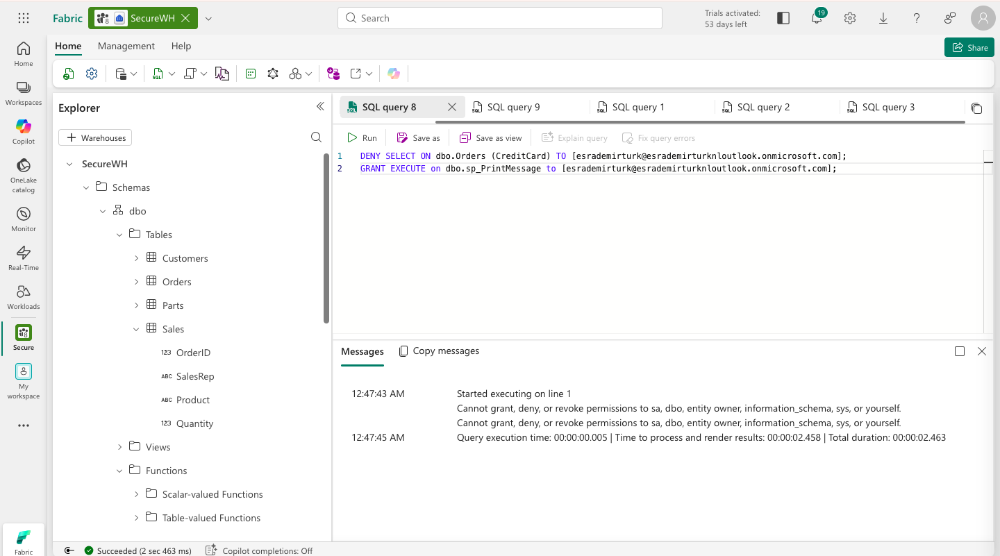

# 🔐 Secure Data in a Microsoft Fabric Data Warehouse


This lab implements **four layers of data security** in a Microsoft Fabric data warehouse — Dynamic Data Masking, Row-Level Security, Column-Level Security, and granular SQL permissions — using T-SQL to control exactly who can see what, and what they can do with it.

---

## 🏗️ Architecture

Before diving in, here is the big picture of the security layers we are building.

> 
> *Four concentric security layers applied to the warehouse: granular permissions at the outermost layer, down to individual cell masking at the innermost.*

### The story of defence in depth

Data security is not a single lock on a single door. It is a series of overlapping controls, each defending a different boundary, each catching what the others miss.

Imagine a warehouse storing customer data — names, emails, phone numbers, credit card numbers, sales records. Different people need different levels of access. A sales rep should only see their own orders. A support agent needs to see customer contact details but not full credit card numbers. An analyst can query aggregated data but should not be able to export raw PII. A junior developer should be able to execute a stored procedure without being able to read the underlying table.

This lab builds exactly that system, layer by layer.

**Dynamic Data Masking (DDM)** is the innermost layer — it works at the column level, replacing sensitive values with masked equivalents for users who lack `UNMASK` permission. The data is still there; it is just hidden. An email like `catherine@adventure-works.com` becomes `cXXX@XXX.com`. A phone number becomes `xxxx`. The table is still queryable; sensitive cells are just obscured.

**Row-Level Security (RLS)** controls which *rows* a user can see. A security predicate — an inline table-valued function — is evaluated for every query. If the function returns false for a row, that row is silently filtered out. A sales rep querying the Sales table only ever sees their own orders, even if they run `SELECT *`.

**Column-Level Security (CLS)** controls which *columns* a user can access. A simple `DENY SELECT ON table (column) TO user` statement makes a column completely invisible to that user. Selecting it returns an error; selecting around it works fine.

**Granular SQL permissions** (GRANT/DENY/REVOKE) are the outermost layer — controlling what operations a user can perform on which objects. A user can be granted `EXECUTE` on a stored procedure while being denied `SELECT` on the table that procedure reads from.

```
┌─────────────────────────────────────────────┐
│         Granular SQL Permissions             │  ← GRANT / DENY / REVOKE on objects
│  ┌───────────────────────────────────────┐   │
│  │        Column-Level Security          │   │  ← DENY SELECT on specific columns
│  │  ┌─────────────────────────────────┐  │   │
│  │  │      Row-Level Security         │  │   │  ← Filter predicate per user
│  │  │  ┌───────────────────────────┐  │  │   │
│  │  │  │   Dynamic Data Masking    │  │  │   │  ← Mask sensitive cell values
│  │  │  └───────────────────────────┘  │  │   │
│  │  └─────────────────────────────────┘  │   │
│  └───────────────────────────────────────┘   │
└─────────────────────────────────────────────┘
```

---

## ⚙️ Prerequisites

- Access to a **Microsoft Fabric** tenant (Trial, Premium, or Fabric capacity)
- Permissions to create Workspaces and Warehouses
- A browser with internet access to reach `app.fabric.microsoft.com`

> 💡 **Note:** As the workspace creator you are automatically a **Workspace Admin** — which means all security controls (DDM, RLS, CLS) are bypassed and you will always see the full unmasked data. This is expected behaviour. The security rules are correctly applied and would restrict any Viewer-role user querying the same tables.

---

## 🗂️ What Gets Created

```
Fabric Warehouse/
└── Schemas/
    ├── dbo/
    │   ├── Tables/
    │   │   ├── Customers     # Dynamic Data Masking demo
    │   │   ├── Sales         # Row-Level Security demo
    │   │   ├── Orders        # Column-Level Security demo
    │   │   └── Parts         # Granular permissions demo
    │   └── Stored Procedures/
    │       └── sp_PrintMessage
    └── rls/
        └── Functions/
            └── fn_securitypredicate   # RLS filter function
```

---

## 🚀 The Story, Step by Step

### Chapter 1 — Setting the Stage: Workspace & Warehouse

Before we can secure data, we need data to secure. We start by creating a workspace and a blank warehouse. Unlike previous labs, we are not loading any sample data — every table in this lab is purpose-built to demonstrate a specific security concept.

The workspace role assignment matters here more than in any other lab. As the creator of the workspace, you are automatically a **Workspace Admin** — which means you can see unmasked data, all rows, all columns. This is expected and correct. The security controls we apply in each chapter are enforced at the database level and would restrict any Viewer-role user — even though you will not see the restricted view yourself.

1. Navigate to the [Microsoft Fabric portal](https://app.fabric.microsoft.com/home?experience=fabric) and sign in.
2. Select **Workspaces** from the left menu bar and create a new workspace with Fabric capacity enabled.
3. From your workspace, select **Create → Warehouse** and give it a unique name.
4. Wait for the empty warehouse to be created.

> 
> *SecureWH — the empty warehouse ready for security configuration.*

---

### Chapter 2 — Masking the Details: Dynamic Data Masking

The first security layer we apply is the most surgical — Dynamic Data Masking. It does not prevent access to a table or a row. It allows queries to run normally but replaces sensitive values with masked equivalents for users who have not been explicitly granted `UNMASK` permission.

This is particularly useful in environments where junior developers, support staff, or analysts need to query customer tables for legitimate reasons — perhaps to count records, check order statuses, or join on customer IDs — but should never be able to see raw PII like phone numbers or email addresses. DDM gives them access to the table without exposing the sensitive cells. The data is there; it is just hidden in plain sight.

There are three mask types applied in this chapter. The `partial` mask on `FirstName` shows only the first character followed by `XXXXXXX`. The `default` mask on `Phone` replaces the entire value with `xxxx`. The `email` mask shows only the first character of the email address followed by `XXX@XXX.com`.

In the warehouse, select the **T-SQL tile** and run the following:

```sql
CREATE TABLE dbo.Customers
(
    CustomerID INT NOT NULL,
    FirstName varchar(50) MASKED WITH (FUNCTION = 'partial(1,"XXXXXXX",0)') NULL,
    LastName varchar(50) NOT NULL,
    Phone varchar(20) MASKED WITH (FUNCTION = 'default()') NULL,
    Email varchar(50) MASKED WITH (FUNCTION = 'email()') NULL
);

INSERT dbo.Customers (CustomerID, FirstName, LastName, Phone, Email) VALUES
(29485, 'Catherine', 'Abel', '555-555-5555', 'catherine0@adventure-works.com'),
(29486, 'Kim', 'Abercrombie', '444-444-4444', 'kim2@adventure-works.com'),
(29489, 'Frances', 'Adams', '333-333-3333', 'frances0@adventure-works.com');

SELECT * FROM dbo.Customers;
```

As a Workspace Admin, the `SELECT` returns unmasked data — this is expected. The masking rules (`MASKED WITH FUNCTION`) are visible in the `CREATE TABLE` statement and correctly applied at the schema level. Any Viewer-role user querying the same table would see masked values.

> 
> *Admin view — full unmasked data returned. Note the `MASKED WITH (FUNCTION = ...)` definitions in the CREATE TABLE statement confirming the masks are in place.*

---

### Chapter 3 — Filtering the Rows: Row-Level Security

Dynamic Data Masking hides cell values. Row-Level Security goes further — it hides entire rows. A user executing a query simply never sees the rows they are not permitted to see. There is no error, no warning, no indication that other rows exist. The filter is completely transparent.

The mechanism is elegant: a security predicate is a function that takes a column value as input and returns `1` (visible) or `0` (hidden). A security policy attaches that function to a table. Every time any query touches that table — SELECT, UPDATE, DELETE — the predicate is evaluated silently for every row. Rows where the predicate returns `0` are filtered out before the results are returned.

In our Sales table, the predicate checks whether the `SalesRep` column matches the currently logged-in user (`USER_NAME()`). A sales rep can only ever see their own orders. The policy is enforced by the database engine, not the application — it cannot be bypassed by clever SQL.

Replace `<username1>` and `<username2>` with real email addresses from your environment (Viewer and Admin respectively):

```sql
CREATE TABLE dbo.Sales
(
    OrderID INT,
    SalesRep VARCHAR(60),
    Product VARCHAR(10),
    Quantity INT
);

INSERT dbo.Sales (OrderID, SalesRep, Product, Quantity) VALUES
(1, '<username1>@<your_domain>.com', 'Valve', 5),
(2, '<username1>@<your_domain>.com', 'Wheel', 2),
(3, '<username1>@<your_domain>.com', 'Valve', 4),
(4, '<username2>@<your_domain>.com', 'Bracket', 2),
(5, '<username2>@<your_domain>.com', 'Wheel', 5),
(6, '<username2>@<your_domain>.com', 'Seat', 5);

SELECT * FROM dbo.Sales;
```

Now create the security predicate and policy:

```sql
-- Separate schema to hold RLS objects
CREATE SCHEMA rls;
GO

-- Predicate: returns 1 if the row's SalesRep matches the current user
CREATE FUNCTION rls.fn_securitypredicate(@SalesRep AS VARCHAR(60))
    RETURNS TABLE
WITH SCHEMABINDING
AS
    RETURN SELECT 1 AS fn_securitypredicate_result
    WHERE @SalesRep = USER_NAME();
GO

-- Policy: apply the predicate as a filter on every query to dbo.Sales
CREATE SECURITY POLICY SalesFilter
ADD FILTER PREDICATE rls.fn_securitypredicate(SalesRep)
ON dbo.Sales
WITH (STATE = ON);
GO
```

Verify the function was created under **Schemas → rls → Functions → Table-valued Functions** in the Explorer pane.

> 
> *Sales table created with 6 rows — all visible to Admin. The placeholder emails in SalesRep column would be replaced with real user emails in a production scenario. The RLS policy silently filters these rows per user at query time.*

---

### Chapter 4 — Locking the Columns: Column-Level Security

Where RLS filters rows and DDM masks values, Column-Level Security takes a blunter approach: it simply refuses to return a specific column to a specific user. A `DENY SELECT ON table (column) TO user` statement makes that column completely inaccessible. If the user's query references the denied column — even inside a `*` — the query fails with a permission error.

This is the right tool when the sensitivity is concentrated in one field. Credit card numbers are the canonical example: an operations team might legitimately need to query the Orders table to look up order status, customer ID, or shipping address — but they should never be able to see the raw card number, even accidentally. CLS makes that impossible at the database level.

```sql
CREATE TABLE dbo.Orders
(
    OrderID INT,
    CustomerID INT,
    CreditCard VARCHAR(20)
);

INSERT dbo.Orders (OrderID, CustomerID, CreditCard) VALUES
(1234, 5678, '111111111111111'),
(2341, 6785, '222222222222222'),
(3412, 7856, '333333333333333');

SELECT * FROM dbo.Orders;
```

Now deny access to the `CreditCard` column — replace `<username1>@<your_domain>.com` with a real user email from your organisation:

```sql
DENY SELECT ON dbo.Orders (CreditCard) TO [<username1>@<your_domain>.com];
```

> ⚠️ **Note:** If you use your own email address (the Admin account), Fabric returns:
> *"Cannot grant, deny, or revoke permissions to sa, dbo, entity owner, information_schema, sys, or yourself."*
> This is correct and expected — the database engine prevents you from restricting your own owner-level access. The DENY syntax is valid and would work correctly against any non-owner user account.

A Viewer running `SELECT * FROM dbo.Orders` will receive an error. Running `SELECT OrderID, CustomerID FROM dbo.Orders` — omitting the denied column — will succeed.

> 
> *Fabric correctly prevents applying DENY to the workspace owner — confirming the security model is enforced at the engine level.*

---

### Chapter 5 — Precision Control: Granular SQL Permissions

The final layer is the most flexible. GRANT, DENY, and REVOKE are the standard SQL data control language commands — they let you assign permissions on any securable object (table, view, stored procedure, schema) to any user or role with surgical precision.

The most interesting pattern this unlocks is asymmetric access: a user can be granted `EXECUTE` on a stored procedure while being denied `SELECT` on the table that procedure reads from. The procedure runs with its own context, the user gets the output, but they cannot query the raw table directly. This is a common pattern in production warehouses — exposing curated, controlled interfaces to data rather than raw table access.

```sql
CREATE PROCEDURE dbo.sp_PrintMessage
AS
PRINT 'Hello World.';
GO

CREATE TABLE dbo.Parts
(
    PartID INT,
    PartName VARCHAR(25)
);

INSERT dbo.Parts (PartID, PartName) VALUES
(1234, 'Wheel'),
(5678, 'Seat');
GO

EXEC dbo.sp_PrintMessage;
GO

SELECT * FROM dbo.Parts;
```

Now apply granular permissions — replace `<username1>@<your_domain>.com` with a real user email:

```sql
DENY SELECT ON dbo.Parts TO [<username1>@<your_domain>.com];
GRANT EXECUTE ON dbo.sp_PrintMessage TO [<username1>@<your_domain>.com];
```

> ⚠️ **Note:** When using your own Admin email, Fabric returns the same owner restriction error as in Chapter 4 — *"Cannot grant, deny, or revoke permissions to yourself."* This confirms the engine-level security model is working correctly. The syntax is valid for any non-owner account.

> 
> *Fabric prevents applying permissions to the workspace owner — the security model correctly identifies and blocks self-permission changes.*

---

## 🔑 Key Concepts

| Concept | Description |
|---|---|
| **Dynamic Data Masking (DDM)** | Replaces sensitive column values with masked equivalents for users without UNMASK permission — data is present but hidden |
| **partial() mask** | Shows a specified number of characters at the start/end of a string, replacing the rest with a custom string |
| **default() mask** | Replaces the full value with a type-appropriate placeholder (xxxx for strings, 0 for numbers) |
| **email() mask** | Shows only the first character of an email address, replacing the rest with XXX@XXX.com |
| **Row-Level Security (RLS)** | Filters rows silently based on a predicate function — users only see rows where the predicate returns true |
| **Security predicate** | An inline table-valued function that evaluates to true/false for each row, controlling visibility |
| **Security policy** | Attaches one or more predicates to a table — enforced automatically on every query |
| **Column-Level Security (CLS)** | Denies access to specific columns via DENY SELECT — queries referencing denied columns return an error |
| **GRANT / DENY / REVOKE** | Standard SQL DCL commands for assigning, removing, or revoking permissions on any securable object |
| **Workspace Admin / Viewer** | Fabric workspace roles — Admins bypass DDM and see unmasked data; Viewers are subject to all security controls |

---

## 📸 Screenshots

Create a `screenshots/` folder at the root of this repository and add the following images:

| File | Description |
|---|---|
| `screenshots/architecture.png` | Your architecture diagram showing the four security layers |
| `screenshots/01-new-warehouse.png` | SecureWH empty warehouse home page |
| `screenshots/02-ddm-admin-view.png` | Admin SELECT on Customers — full unmasked data with MASKED definitions visible |
| `screenshots/03-rls-sales-table.png` | Sales table created with 6 rows — all visible to Admin |
| `screenshots/04-cls-owner-error.png` | DENY on own account — engine correctly blocks self-permission change |
| `screenshots/05-granular-owner-error.png` | GRANT/DENY on own account — same owner restriction error confirmed |

---

## 🧹 Clean Up

To remove all resources after completing the lab:

1. In the left navigation bar, select the icon for your workspace.
2. Select **Workspace settings → General**.
3. Select **Remove this workspace → Delete**.

---

## 📚 Resources

- [Microsoft Fabric Documentation](https://learn.microsoft.com/fabric/)
- [Dynamic Data Masking in Fabric](https://learn.microsoft.com/fabric/data-warehouse/dynamic-data-masking)
- [Row-Level Security in SQL](https://learn.microsoft.com/sql/relational-databases/security/row-level-security)
- [Column-Level Security in Fabric](https://learn.microsoft.com/fabric/data-warehouse/column-level-security)
- [SQL Permissions (GRANT, DENY, REVOKE)](https://learn.microsoft.com/sql/t-sql/statements/grant-transact-sql)
- [Source Lab (MS Learn)](https://microsoftlearning.github.io/mslearn-fabric/)

---

## 🪪 License

This project is based on lab content from the [Microsoft Learn Fabric repository](https://github.com/MicrosoftLearning/mslearn-fabric).  
© 2025 Microsoft — used for educational purposes.