# ⚡ Get Started with Real-Time Intelligence in Microsoft Fabric


This lab introduces **Real-Time Intelligence** in Microsoft Fabric — creating an eventstream to ingest live stock market data, storing it in a KQL database via an eventhouse, querying the stream with KQL, visualising it on a real-time dashboard, and triggering automated alerts with Activator. It builds directly on the Lakehouse foundation and extends it into the world of streaming data.

---

## 🏗️ Architecture

Before diving in, here is the big picture of what we are building.

```
[ Stock Market Sample ]       ← External streaming data source
         │
         ▼
  [ Eventstream ]             ← stock-data (ingestion layer)
  stock-data-stream
         │
         ▼
  [ Eventhouse / KQL DB ]     ← Persistent storage as a Delta table
       stock (table)
         │
         ▼
  [ KQL Queryset ]            ← Query with Kusto Query Language
         │              │
         ▼              ▼
  [ Real-Time Dashboard ]   [ Activator Alert ]   ← Visualise & act
```

> Real-Time Intelligence architecture: live stream → eventstream → KQL table → dashboard and alert.

---

## The story of our data

Batch analytics works well when the data has already arrived. But financial markets, IoT sensors, logistics systems, and user activity streams do not wait — they generate data continuously, and the value of that data often decays within seconds. A stock price that was accurate two minutes ago may already be dangerously stale.

Traditional analytics pipelines were not built for this. They ingested data in hourly or daily batches, ran overnight jobs, and produced dashboards that showed what happened yesterday. For many business questions, yesterday is too late.

Real-Time Intelligence in Microsoft Fabric is the answer to that problem. It provides a complete, integrated stack for streaming data: a managed ingestion layer (**Eventstream**), a high-performance analytical store (**Eventhouse / KQL Database**), a query language designed for time-series data (**KQL**), a live visualisation layer (**Real-Time Dashboard**), and an event-driven automation engine (**Activator**). These are not separate products bolted together — they are native Fabric items that share the same workspace, the same security model, and the same OneLake storage layer.

This lab traces a complete streaming pipeline from source to action. By the end, the same stock price data is being ingested continuously, queried in near real-time with KQL, visualised on a live dashboard, and watched by an automated alert that will fire the moment a price threshold is crossed.

---

## ⚙️ Prerequisites

- Access to a Microsoft Fabric tenant (Trial, Premium, or Fabric capacity)
- Permissions to create Workspaces, Eventhouses, and Eventstreams
- A browser with internet access to reach [app.fabric.microsoft.com](https://app.fabric.microsoft.com)

No local tooling or SDK installation is required. All steps are performed within the Fabric web interface.

---

## 🗂️ What Gets Created

```
Fabric Workspace/
├── Eventstream/
│   └── stock-data                  # Ingestion pipeline from stock market sample
│       └── stock-data-stream       # Default output stream
├── Eventhouse/
│   └── KQL Database/
│       ├── stock (table)           # Delta table receiving live stream data
│       └── queryset                # Sample KQL queries
├── Real-Time Dashboard/
│   └── Stock Dashboard             # Live column chart of average prices
└── Activator/
    └── avgPrice alert              # Email trigger on price increase > 100
```

---

## 🚀 The Story, Step by Step

### Chapter 1 — Laying the Foundation: Workspace

Every analytics solution in Microsoft Fabric starts with a Workspace. This is not just an administrative folder — it is the security and capacity boundary for all resources you create. Eventstreams, Eventhouses, dashboards, and activators all live inside a workspace, and they can reference each other directly without any cross-tenant plumbing.

For streaming workloads, the workspace also determines which Fabric capacity handles the compute. Real-Time Intelligence features require Fabric capacity — a Trial capacity is sufficient for this lab.

1. Navigate to the [Microsoft Fabric portal](https://app.fabric.microsoft.com/home?experience=fabric) and sign in.
2. Select **Workspaces** from the left menu bar (🗇 icon).
3. Create a new workspace and select a licensing mode that includes Fabric capacity (**Trial**, **Premium**, or **Fabric**).
4. Wait for the workspace to open — it should be empty.

---

### Chapter 2 — Building the Ingestion Layer: Eventstream

An Eventstream is Fabric's managed ingestion service for real-time data. It connects to a source — a streaming platform, a sample dataset, an IoT hub, or a custom endpoint — and routes the data to one or more destinations. Between source and destination, transformations can be applied: filtering, aggregation over time windows, schema mapping, and more.

For this lab, we use the built-in **Stock market sample** — a continuously generated feed of simulated stock prices that requires no external account or API key. In a production scenario, this would be replaced by an Azure Event Hub, Kafka topic, or IoT Hub connection.

The eventstream design canvas makes the flow visible. Each node on the canvas is a component in the pipeline — source on the left, transformations in the middle, destinations on the right. As data flows, you can preview it at each stage without writing any code.

1. In the left menu bar, select **Real-Time hub**.

   > If the Real-Time hub is not visible, select `...` and pin it to the menu bar.

2. In the Real-Time hub, select **Add data**.
3. Select the **Stock market sample** data source.

> 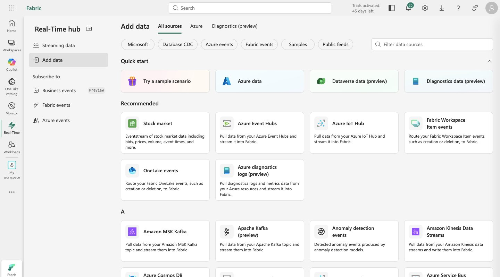
> *The Real-Time Hub — Add data screen showing available streaming sources including the Stock market sample.*

4. Configure the source:

   | Field | Value |
   |-------|-------|
   | Source name | `stock` |
   | Workspace | Your workspace |
   | Eventstream name | `stock-data` |

   > The default stream will be automatically named `stock-data-stream`.

5. Select **Next**, then **Connect** to create the eventstream.

> 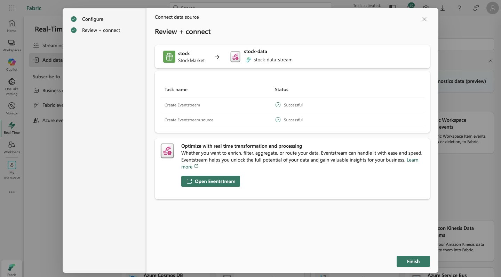
> *Review + connect screen confirming both Create Eventstream and Create Eventstream source completed successfully.*

6. Select **Open eventstream** — the design canvas will show the `stock` source connected to `stock-data-stream`.

> 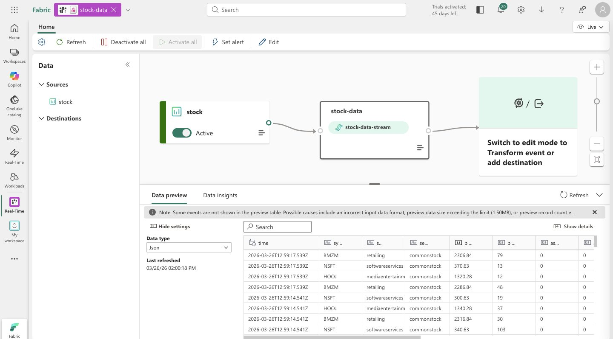
> *The eventstream design canvas with the stock source active and stock-data-stream flowing through — data preview visible at the bottom.*

---

### Chapter 3 — Storing the Stream: Eventhouse & KQL Database

An Eventstream without a destination is a pipe with nowhere to go. The **Eventhouse** is that destination — a purpose-built analytical store for high-frequency, time-series data. Unlike a Lakehouse, which is optimised for large batch files, an Eventhouse is designed for continuous ingestion: millions of rows per second, with immediate queryability after arrival.

Inside every Eventhouse is a **KQL Database** — a structured store of tables, materialized views, and functions. The query language is **Kusto Query Language (KQL)**: a pipe-based syntax designed for filtering, aggregating, and reasoning over time. `where ["time"] > ago(5m)` is idiomatic KQL — natural to read, and extremely efficient to execute.

When a KQL table is connected to an Eventstream destination, data flows automatically from stream to table with no manual intervention. The table grows continuously. Every query runs against the live, current state.

1. In the left menu bar, select **Create** → **Eventhouse** (under Real-Time Intelligence).

   > If Create is not pinned, select `...` first.

2. Give the Eventhouse a unique name and wait for it to be provisioned.
3. Close any tips. In the left pane, note the **KQL database** with the same name as the Eventhouse.

> 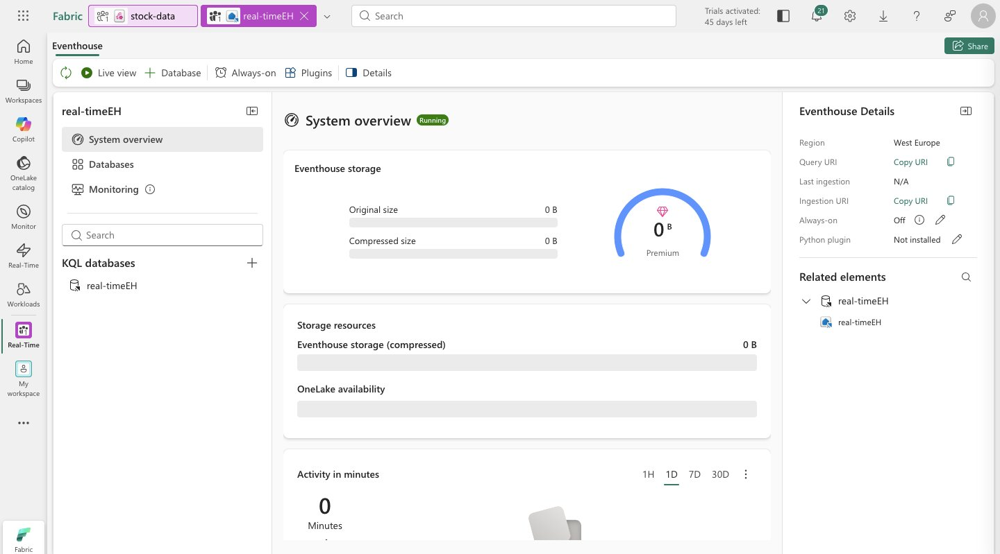
> *The newly provisioned Eventhouse — System overview shows Running status with the KQL database visible in the left pane.*

4. Select the database — observe the associated **queryset** containing starter KQL queries.

**Connect the stream to a table:**

5. In the KQL database main page, select **Get data**.
6. Choose **Eventstream → Existing eventstream**.
7. In the destination table pane, create a new table named `stock`.
8. In the data source configuration pane:

   | Field | Value |
   |-------|-------|
   | Workspace | Your workspace |
   | Eventstream | `stock-data` |
   | Connection name | `stock-table` |

> 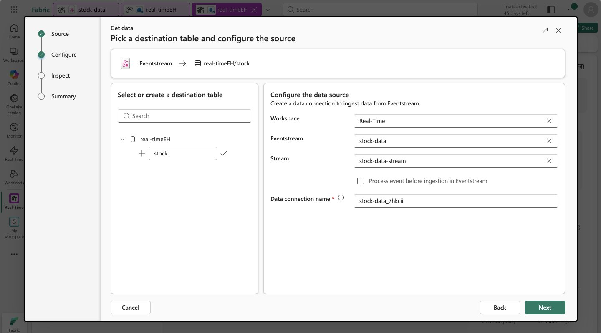
> *Get data configuration — selecting the stock-data eventstream and creating the stock destination table.*

9. Complete the remaining steps — the Inspect screen confirms live data is flowing from the stream.

> 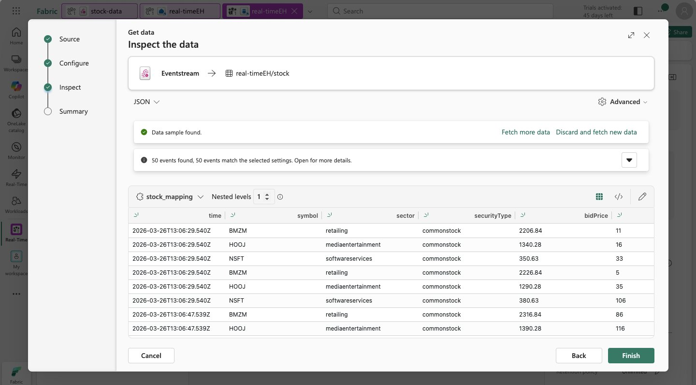
> *Inspect the data screen — 50 events found, confirming the Eventstream → Eventhouse connection is live and data is arriving.*

10. Close the configuration window. Return to the eventstream (**Real-Time hub → stock-data-stream → Open eventstream**) and verify that a destination node now appears on the design canvas.

    > Select the destination node and click **Refresh** if no data preview is shown.

---

### Chapter 4 — Asking Questions in Real Time: KQL Queries

With the `stock` table receiving a continuous feed of price data, we can start querying it. KQL's time-filtering primitives make it natural to ask questions like "what happened in the last five minutes" — a query that would require complex window logic in SQL is a single `ago()` call in KQL.

The second query below captures the business question we care about: for each stock symbol, what is the average bid price right now? Run it once, wait a few seconds, and run it again — the numbers will change. This is live data. The dashboard we build in the next chapter will automate this refresh.

1. In the left menu bar, select your Eventhouse database.
2. Open the **queryset** for your database.

**Explore the raw data:**

```kql
stock
| take 100
```

> 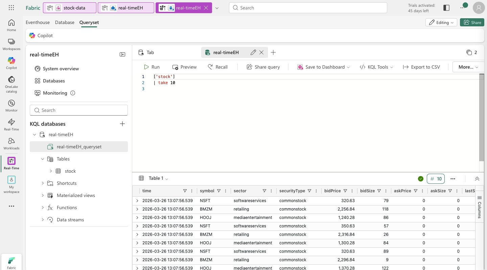
> *`stock | take 100` returns 100 rows from the live table — columns include time, symbol, sector, securityType, bidPrice, bidSize, askPrice, and more.*

**Aggregate by symbol over the last 5 minutes:**

```kql
stock
| where ["time"] > ago(5m)
| summarize avgPrice = avg(todecimal(bidPrice)) by symbol
| project symbol, avgPrice
```

> 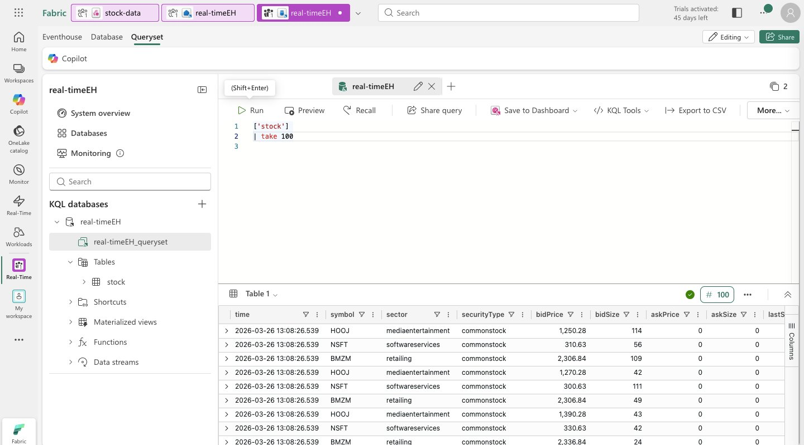
> *Average bid price per symbol over the last 5 minutes — 3 rows returned for HOOJ, NSFT, and BMZM. Run it again after a few seconds and the values will shift.*

Highlight the query and run it. Then wait a few seconds and run it again — observe the average prices shifting as new data arrives from the stream.

---

### Chapter 5 — Making it Visual: Real-Time Dashboard

A query you have to run manually is an analysis. A dashboard that runs it automatically on a schedule is a monitoring tool. Real-Time Dashboards in Fabric bridge that gap — they execute KQL queries on a configurable refresh interval and render the results as charts, tables, or other visual types.

The dashboard we create takes the five-minute average price query and renders it as a column chart — one bar per stock symbol, height proportional to average price. Every time the dashboard refreshes, the query re-executes and the chart updates. This is not a static snapshot; it is a live window into the data stream.

1. In the query editor, select the average price KQL query from the previous chapter.
2. On the toolbar, select **Save to dashboard**.
3. Pin the query to a new dashboard:

   | Field | Value |
   |-------|-------|
   | Dashboard name | `Stock Dashboard` |
   | Tile name | `Average Prices` |

4. Create and open the dashboard — the tile initially renders as a table.

> 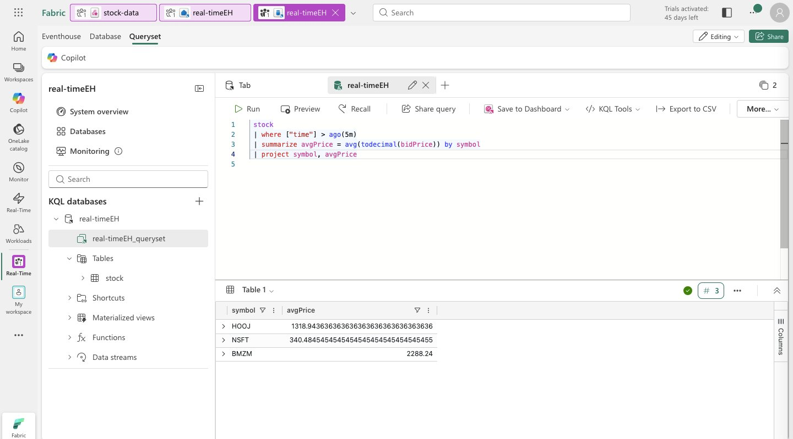
> *Stock Dashboard created — the Average Prices tile shows symbol and avgPrice in table format before switching to a chart.*

5. Switch from **Viewing** to **Editing** mode (top-right toggle).
6. Select the **Edit** (pencil) icon on the **Average Prices** tile.
7. In the **Visual formatting** pane, change **Visual** from `Table` → `Column chart`.

> 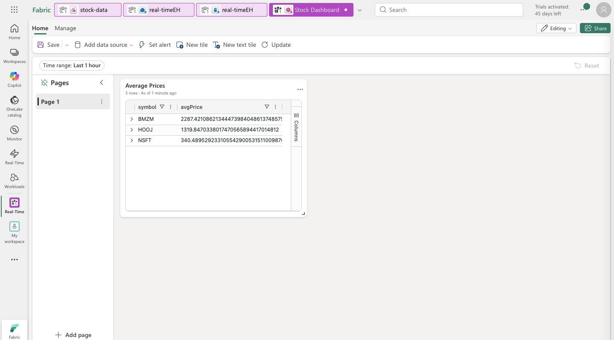
> *Editing the tile — Visual type set to Column chart, with a live preview showing BMZM, HOOJ, and NSFT as bars.*

8. Select **Apply changes**.

> 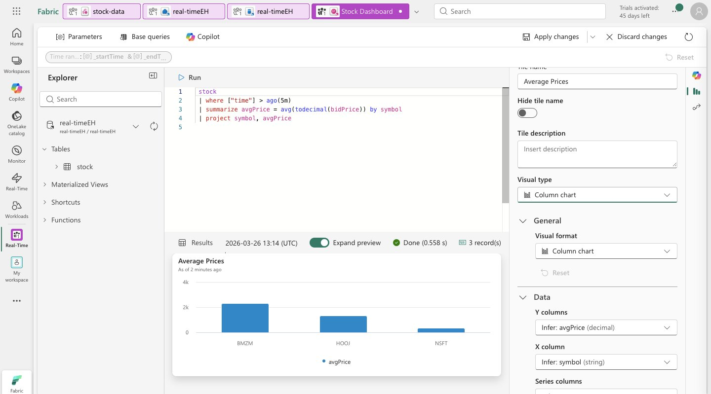
> *The finished Stock Dashboard — Average Prices rendered as a column chart, refreshing automatically as new stream data arrives.*

---

### Chapter 6 — Closing the Loop: Activator Alert

A dashboard tells you what is happening. An alert tells you when something important has happened and you need to act. **Activator** is Fabric's event-driven automation engine — it watches a query or data stream, evaluates a condition on each result, and triggers an action when the condition is met.

The alert we configure watches the `avgPrice` column in the dashboard query, grouped by `symbol`. If the average price for any single stock increases by more than 100 within a five-minute window, Activator sends an email. In a production scenario, the action could also be a Teams message, a Power Automate flow, or a webhook to an external system.

1. In the dashboard toolbar, select **Set alert**.
2. Configure the alert:

   | Setting | Value |
   |---------|-------|
   | Run query every | 5 minutes |
   | Check | On each event grouped by |
   | Grouping field | `symbol` |
   | When | `avgPrice` |
   | Condition | Increases by |
   | Value | `100` |
   | Action | Send me an email |

3. Under **Save location**, select your workspace and choose **Create a new item** with a unique name.
4. Create the alert and close the confirmation pane.

**Verify the activator:**

5. Navigate to your workspace and open the **Activator** item.
6. Under the `avgPrice` node, select the unique identifier for your alert.
7. Open the **Definition** tab to review the monitoring configuration.

> 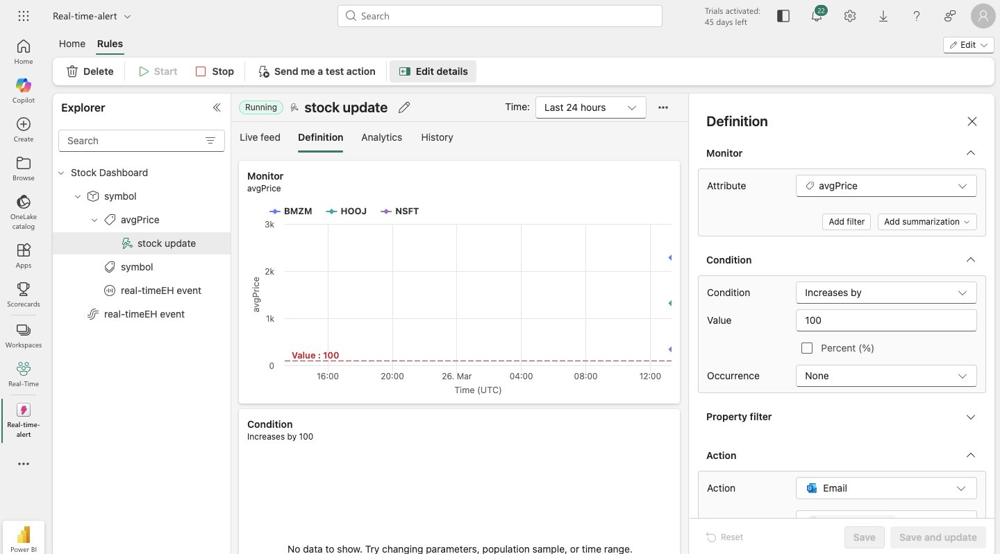
> *Activator alert definition — monitoring avgPrice grouped by symbol, with Condition set to "Increases by 100" and Action set to Email. The threshold line at Value: 100 is visible on the monitor chart.*

---

## 🔑 Key Concepts

| Concept | Description |
|---------|-------------|
| **Eventstream** | A managed ingestion pipeline that connects streaming sources to Fabric destinations |
| **Eventhouse** | A high-performance analytical store optimised for continuous, time-series data ingestion |
| **KQL Database** | A structured store of tables and functions inside an Eventhouse, queryable with Kusto Query Language |
| **KQL** | Kusto Query Language — a pipe-based query language designed for filtering and aggregating time-series data |
| **Real-Time Hub** | A centralised catalogue of streaming data sources available in Fabric |
| **Real-Time Dashboard** | A live visualisation layer that executes KQL queries on a configurable refresh interval |
| **Activator** | Fabric's event-driven automation engine — watches data, evaluates conditions, triggers actions |
| **`ago()`** | A KQL time function — `ago(5m)` means "5 minutes before now", enabling sliding-window queries |
| **OneLake** | Fabric's single logical data lake — Eventhouse tables are stored here in Delta format |

---

## 📸 Screenshots

| File | Description |
|------|-------------|
| `screenshots/01-realtimehub-adddata.png` | Real-Time Hub — Add data screen with available streaming sources |
| `screenshots/02-eventstream-connected.png` | Review + connect confirming eventstream created successfully |
| `screenshots/03-eventstream-canvas.png` | Eventstream design canvas with stock source and data preview |
| `screenshots/04-eventhouse-overview.png` | Eventhouse System overview — Running status |
| `screenshots/05-getdata-configure.png` | Get data — destination table and eventstream configuration |
| `screenshots/06-getdata-inspect.png` | Get data — Inspect screen confirming 50 live events found |
| `screenshots/07-kql-take100.png` | KQL `take 100` query results showing raw stock data |
| `screenshots/08-kql-avgprice.png` | KQL avgPrice aggregation — 3 symbols with live average prices |
| `screenshots/09-dashboard-table.png` | Stock Dashboard — Average Prices tile in table format |
| `screenshots/10-dashboard-edit-chart.png` | Dashboard tile edit — Visual type changed to Column chart |
| `screenshots/11-dashboard-columnchart.png` | Final dashboard — live column chart per stock symbol |
| `screenshots/12-activator-alert.png` | Activator alert definition — "Increases by 100" condition with email action |

---

## 🧹 Clean Up

1. In the left navigation bar, select the icon for your workspace.
2. Select **Workspace settings → General**.
3. Scroll down and select **Remove this workspace → Delete**.

---

## 📚 Resources

- [Microsoft Fabric Documentation](https://learn.microsoft.com/en-us/fabric/)
- [Real-Time Intelligence Overview](https://learn.microsoft.com/en-us/fabric/real-time-intelligence/overview)
- [Kusto Query Language (KQL) Reference](https://learn.microsoft.com/en-us/azure/data-explorer/kusto/query/)
- [Eventhouse in Microsoft Fabric](https://learn.microsoft.com/en-us/fabric/real-time-intelligence/eventhouse)
- [Activator in Microsoft Fabric](https://learn.microsoft.com/en-us/fabric/real-time-intelligence/data-activator/activator-introduction)
- [Source Lab (MS Learn)](https://learn.microsoft.com/en-us/training/modules/get-started-kusto-fabric/)

---

## 🪪 License

This project is based on lab content from the [Microsoft Learn Fabric repository](https://github.com/MicrosoftLearning/mslearn-fabric).  
© 2025 Microsoft — used for educational purposes.