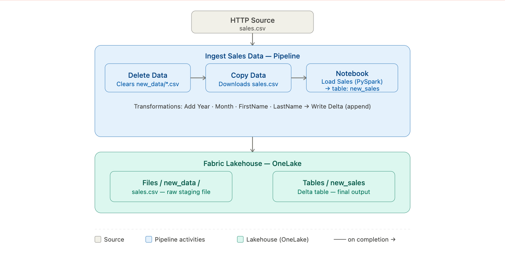

# 🏭 Data Ingestion with Pipelines in Microsoft Fabric


This lab walks through building a complete **ELT pipeline** in Microsoft Fabric — pulling raw sales data from an HTTP source, staging it in a Lakehouse, transforming it with a PySpark notebook, and loading it into a Delta table. All three steps are orchestrated by a single, reusable pipeline.

---

## 🏗️ Architecture

Before diving in, here is the big picture of what we are building.

> 
> *End-to-end architecture: HTTP source → Pipeline (Delete → Copy → Notebook) → Lakehouse Delta table.*

### The story of our data

Every data pipeline starts with a question: *how do we get data from where it is, to where it needs to be, reliably and repeatedly?*

This lab answers that question with a three-stage pipeline. Raw sales data lives at a public HTTP URL as a CSV file — unstructured, untyped, and not queryable. Our job is to bring it into Microsoft Fabric, clean it up, and make it available as a proper analytical table.

The first challenge is freshness. We do not want old files mixing with new ones on every run, so we start by **deleting** any existing CSV files from the staging folder. This guarantees a clean slate every time the pipeline executes.

The second step is ingestion. A **Copy Data** activity downloads the CSV from the HTTP source and places it in the Lakehouse's `Files` section — a staging area where raw files live before being processed. At this point the data exists in Fabric, but it is still just a flat file.

The third step is where the real work happens. A **Spark Notebook** picks up the staged CSV, applies a series of transformations — adding year and month columns, splitting customer names, reordering fields — and writes the result as a managed **Delta table**. Delta format gives us ACID transactions, schema enforcement, and the ability to query the data with SQL or Power BI immediately after the pipeline finishes.

```
HTTP Source (sales.csv)
        │
        ▼
  [ Delete old files ]   ← Clears staging area before each run
        │
        ▼
  [ Copy Data ]          ← Ingests raw CSV into Lakehouse Files
        │
        ▼
  [ Spark Notebook ]     ← Transforms data and writes Delta table
        │
        ▼
  Lakehouse Delta Table (new_sales)
```

---

## ⚙️ Prerequisites

- Access to a **Microsoft Fabric** tenant (Trial, Premium, or Fabric capacity)
- Permissions to create Workspaces, Lakehouses, Pipelines, and Notebooks
- A browser with internet access to reach `app.fabric.microsoft.com`

No local tooling or SDK installation is required. All steps are performed within the Fabric web interface.

---

## 🗂️ What Gets Created

```
Fabric Workspace/
├── Lakehouse/
│   ├── Files/
│   │   └── new_data/            # Staging folder for raw CSV ingestion
│   └── Tables/
│       └── new_sales            # Final Delta Lake table (output)
├── Pipelines/
│   └── Ingest Sales Data        # Main orchestration pipeline
└── Notebooks/
    └── Load Sales               # PySpark transformation notebook
```

---

## 🚀 The Story, Step by Step

### Chapter 1 — Setting the Scene: Workspace & Lakehouse

Before we can move data, we need somewhere to put it. The **Workspace** is the top-level container in Fabric — every resource we create lives inside one. The **Lakehouse** is our central storage layer — a unified store that handles both raw files and structured Delta tables on top of OneLake.

We also create a `new_data` subfolder inside the Lakehouse's Files section. This is our staging area — a deliberate intermediate stop where raw CSV files land before being processed. Keeping raw data separate from the final tables is a best practice: it means we can always re-run the transformation from the original file without needing to re-download anything.

1. Navigate to the [Microsoft Fabric portal](https://app.fabric.microsoft.com/home?experience=fabric-developer) and sign in.
2. Select **Workspaces** from the left menu bar and create a new workspace with Fabric capacity enabled.
3. From your workspace, select **Create → Lakehouse** (under Data Engineering).
4. Give it a unique name and ensure **Lakehouse schemas (Public Preview)** is **disabled**.
5. In the Explorer pane, select the **...** menu next to **Files → New subfolder** and create a folder named `new_data`.

---

### Chapter 2 — The First Run: Copy Data Pipeline

With the Lakehouse ready, we build the first version of our pipeline — a simple Copy Data activity that pulls the CSV from its HTTP source and drops it into the staging folder. This alone is not a complete solution, but it proves the connection works and gives us a file to work with in the next chapter.

The Copy Data wizard handles all the HTTP configuration — URL, authentication, file format — and maps the output directly to our Lakehouse path. No code required.

1. From the Lakehouse home page, select **Get data → New data pipeline** and name it `Ingest Sales Data`.
2. If the Copy Data wizard does not open automatically, select **Copy Data → Use copy assistant**.
3. Configure the **data source**:

   | Setting | Value |
   |---|---|
   | Source type | HTTP |
   | URL | `https://raw.githubusercontent.com/MicrosoftLearning/dp-data/main/sales.csv` |
   | Authentication kind | Anonymous |
   | File format | DelimitedText (CSV) |
   | First row as header | ✅ Selected |

4. Configure the **data destination**:

   | Setting | Value |
   |---|---|
   | Root folder | Files |
   | Folder path | `new_data` |
   | File name | `sales.csv` |

5. Select **Save + Run** and wait for a `Succeeded` status in the Output pane.
6. Navigate back to the Lakehouse and verify `sales.csv` appears under `Files/new_data/`.

> 
> *Pipeline designer showing the Copy Data activity after successful execution.*

> 
> *sales.csv visible in the Lakehouse Files/new_data staging folder.*

---

### Chapter 3 — Making Sense of the Data: The Transformation Notebook

A raw CSV file is not analysis-ready. Column names are inconsistent, dates have no derived attributes, customer names are stored as a single field, and there is no schema enforcement. The PySpark notebook fixes all of this.

The notebook is parameterised — the `table_name` variable is declared in a special parameter cell, which means the pipeline can override it at runtime. This is what allows the same notebook to write to `sales` during standalone testing and `new_sales` when invoked by the pipeline — without changing a single line of code.

1. From the Lakehouse, select **Open notebook → New notebook** and rename it to `Load Sales`.
2. Select the first cell and replace its contents with the parameter declaration, then **toggle it as a Parameter cell**:

```python
table_name = "sales"
```

3. Add a second code cell with the transformation logic:

```python
from pyspark.sql.functions import *

# Read raw CSV from the staging folder
df = spark.read.format("csv").option("header","true").load("Files/new_data/*.csv")

# Add Year and Month columns from OrderDate
df = df.withColumn("Year", year(col("OrderDate"))) \
       .withColumn("Month", month(col("OrderDate")))

# Split CustomerName into FirstName and LastName
df = df.withColumn("FirstName", split(col("CustomerName"), " ").getItem(0)) \
       .withColumn("LastName", split(col("CustomerName"), " ").getItem(1))

# Select and reorder final columns
df = df["SalesOrderNumber", "SalesOrderLineNumber", "OrderDate", "Year", "Month",
        "FirstName", "LastName", "EmailAddress", "Item", "Quantity", "UnitPrice", "TaxAmount"]

# Write to Delta table — append mode
df.write.format("delta").mode("append").saveAsTable(table_name)
```

4. Select **Run all**. The first run may take a minute as the Spark pool initialises.
5. In the Explorer pane, refresh **Tables** and verify the `sales` table has been created.

> 
> *Notebook with the parameter cell and transformation code — note the parameter cell indicator.*

---

### Chapter 4 — The Complete Pipeline: Delete, Copy, Transform

The previous chapters gave us the individual pieces. Now we assemble them into a complete, production-ready pipeline. The key addition is a **Delete Data** activity at the start — this ensures old CSV files are removed before new ones are copied, preventing duplicate data from accumulating in the staging folder across multiple pipeline runs.

This pattern — delete staging → copy fresh → transform — is the backbone of most incremental ELT pipelines in production. It is simple, deterministic, and easy to reason about when something goes wrong.

1. Navigate back to the **Ingest Sales Data** pipeline.
2. From the **Activities** tab, add a **Delete data** activity and position it to the left of the Copy Data activity.
3. Connect its **On completion** output to the Copy Data activity.
4. Configure the **Delete data** activity:

   | Property | Value |
   |---|---|
   | Name | `Delete old files` |
   | Connection | Your Lakehouse |
   | File path type | Wildcard file path |
   | Folder path | `Files / new_data` |
   | Wildcard file name | `*.csv` |
   | Recursively | ✅ Enabled |
   | Enable logging | Disabled |

5. From the **Activities** tab, add a **Notebook** activity to the right of Copy Data.
6. Connect the Copy Data **On completion** output to the Notebook activity.
7. Configure the **Notebook** activity:

   | Property | Value |
   |---|---|
   | Name | `Load Sales notebook` |
   | Notebook | `Load Sales` |

8. Under **Base parameters**, add:

   | Name | Type | Value |
   |---|---|---|
   | `table_name` | String | `new_sales` |

9. Save the pipeline and select **▷ Run**. Wait for all three activities to complete successfully.
10. Navigate to your Lakehouse, expand **Tables**, and confirm the `new_sales` table is present.

> 
> *Complete pipeline — Delete, Copy Data, and Notebook activities connected in sequence.*

> 
> *The new_sales Delta table in the Lakehouse Explorer, created by the notebook when run by the pipeline.*

---

## 🔄 Transformations Applied

| Transformation | Input | Output | Why |
|---|---|---|---|
| Add `Year` column | `OrderDate` | `Year` (Integer) | Enables year-based filtering and grouping |
| Add `Month` column | `OrderDate` | `Month` (Integer) | Enables month-based analysis |
| Split customer name | `CustomerName` | `FirstName`, `LastName` | Normalises name data for downstream use |
| Column reorder | All columns | Final 12-column schema | Removes raw fields, enforces clean schema |
| Write mode | — | Append to Delta table | Safe for repeated runs — no data loss |

---

## 🔑 Key Concepts

| Concept | Description |
|---|---|
| **Lakehouse** | Unified storage combining data lake flexibility with warehouse query performance |
| **OneLake** | Fabric's single logical data lake underpinning all Lakehouse storage |
| **Delta Lake** | Open-source table format enabling ACID transactions on the Lakehouse |
| **Staging folder** | An intermediate landing zone for raw files before transformation |
| **Parameter cell** | A notebook cell whose variables can be overridden by pipeline parameters at runtime |
| **ELT** | Extract, Load, Transform — raw data lands first, transformation happens in-place |

---

## 📸 Screenshots

| File | Description |
|---|---|
| `screenshots/architecture.png` | End-to-end architecture diagram |
| `screenshots/copy-data.png` | Copy Data activity after successful first run |
| `screenshots/showing-file.png` | sales.csv in Lakehouse Files/new_data |
| `screenshots/notebook-load-modify-data.png` | Notebook with parameter and transformation cells |
| `screenshots/delete-copy-load-data.png` | Final pipeline with all three activities |
| `screenshots/showing-table.png` | new_sales Delta table in Lakehouse Explorer |

---

## 🧹 Clean Up

1. In the left navigation bar, select the icon for your workspace.
2. Select **Workspace settings → General**.
3. Scroll down and select **Remove this workspace → Delete**.

---

## 📚 Resources

- [Microsoft Fabric Documentation](https://learn.microsoft.com/fabric/)
- [Apache Spark in Microsoft Fabric](https://learn.microsoft.com/fabric/data-engineering/spark-overview)
- [Delta Lake Overview](https://delta.io/)
- [Source Lab (MS Learn)](https://microsoftlearning.github.io/mslearn-fabric/)

---

## 🪪 License

This project is based on the [Microsoft Learn Fabric lab](https://github.com/MicrosoftLearning/mslearn-fabric) content.  
© 2025 Microsoft — used for educational purposes.