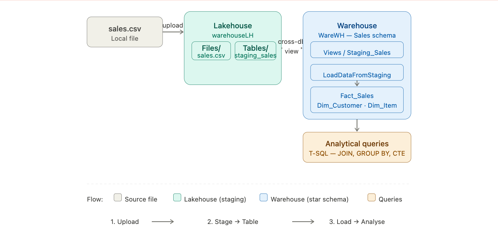
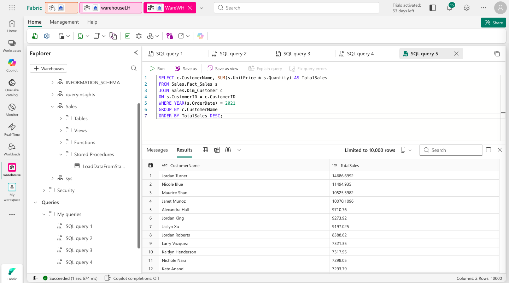
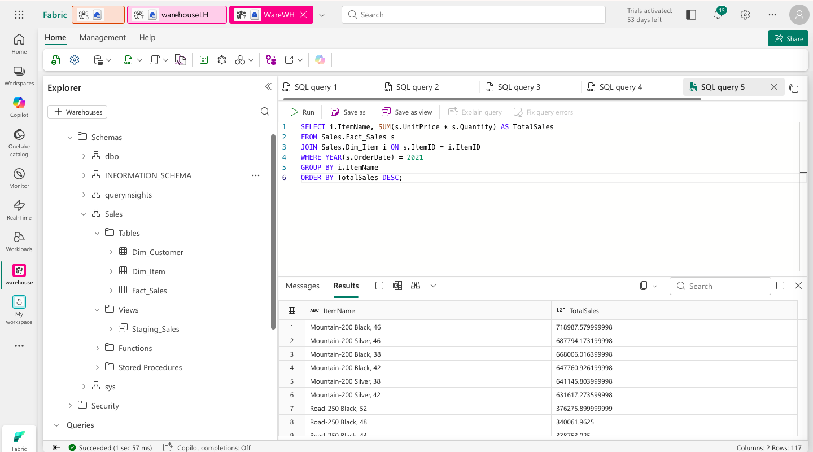

# 🏛️ Load Data into a Warehouse using T-SQL in Microsoft Fabric


This lab walks through building a **dimensional data warehouse** in Microsoft Fabric — ingesting raw sales data into a Lakehouse, modelling it into fact and dimension tables, loading it via a T-SQL stored procedure, and running analytical queries to extract business insights.

---

## 🏗️ Architecture

Before diving in, here is the big picture of how all the pieces connect.

> 
> *End-to-end architecture: CSV → Lakehouse staging → Warehouse fact & dimension tables → Analytical T-SQL queries.*

### The story of our data

Every data warehouse project starts with the same fundamental question: *how do we get messy, raw data into a clean, queryable structure?* This lab answers that question step by step.

It begins with a single CSV file — raw sales records with no structure, no relationships, no guarantees about data types. We upload it to a **Lakehouse**, which acts as our staging ground. Think of the Lakehouse as the loading dock: data arrives here first, unprocessed.

From there, we create a **Warehouse** — a fully relational SQL engine sitting right next to the Lakehouse inside the same Fabric workspace. The warehouse is where structure lives: a `Fact_Sales` table recording every transaction, a `Dim_Customer` table holding unique customers, and a `Dim_Item` table holding unique products. This is the classic **star schema** used in almost every analytical system in the world.

The bridge between the two is a **view** that points from the warehouse directly at the Lakehouse staging table, and a **stored procedure** that reads from that view and populates the warehouse tables with a single SQL `EXEC` command. This pattern — stage first, load second — keeps the raw data intact and makes the load process repeatable and auditable.

Finally, we run **analytical queries** that join across fact and dimension tables to answer real business questions: who are the top customers? Which products sold best? Who spent the most in each product category?

```
sales.csv (local)
      │
      ▼
[ Lakehouse ]
  Files/sales.csv
  Tables/staging_sales       ← Raw data loaded as a managed table
      │
      ▼ (cross-database view)
[ Warehouse — Sales Schema ]
  Views/Staging_Sales        ← Points directly at Lakehouse table
      │
      ▼ (stored procedure)
  Fact_Sales                 ← All transactions
  Dim_Customer               ← Unique customers
  Dim_Item                   ← Unique products
      │
      ▼
[ Analytical T-SQL Queries ] ← JOINs, aggregations, window functions
```

---

## ⚙️ Prerequisites

- Access to a **Microsoft Fabric** tenant (Trial, Premium, or Fabric capacity)
- Permissions to create Workspaces, Lakehouses, and Warehouses
- A browser with internet access to reach `app.fabric.microsoft.com`

No local tooling or SDK installation is required. All steps are performed within the Fabric web interface.

---

## 🗂️ What Gets Created

```
Fabric Workspace/
├── Lakehouse/
│   ├── Files/
│   │   └── sales.csv              # Raw uploaded file
│   └── Tables/
│       └── staging_sales          # Managed Delta table from CSV
└── Warehouse/
    └── Sales (schema)
        ├── Tables/
        │   ├── Fact_Sales         # All sales transactions
        │   ├── Dim_Customer       # Customer dimension
        │   └── Dim_Item           # Product dimension
        ├── Views/
        │   └── Staging_Sales      # Cross-database view → Lakehouse
        └── Stored Procedures/
            └── LoadDataFromStaging
```

---

## 🚀 The Story, Step by Step

### Chapter 1 — Setting the Stage: Workspace & Lakehouse

Every project needs a home. We start by creating a **Workspace** — the top-level container in Fabric where all our resources will live — and a **Lakehouse** to receive the raw data.

The Lakehouse plays a specific role here: it is not the final destination for our data, but the first stop. Raw CSV files land here, get loaded into a staging table, and wait to be processed into the warehouse. This separation is intentional — keeping raw data in the Lakehouse means we can always re-run the warehouse load from scratch without needing to re-download the source file.

1. Navigate to the [Microsoft Fabric portal](https://app.fabric.microsoft.com/home?experience=fabric) and sign in.
2. Select **Workspaces** from the left menu bar and create a new workspace with Fabric capacity enabled.
3. From your workspace, select **+ New item → Lakehouse** and give it a unique name.
4. Download the source data from: `https://github.com/MicrosoftLearning/dp-data/raw/main/sales.csv`
5. In the Lakehouse Explorer, select the **...** menu next to **Files → Upload → Upload files** and upload `sales.csv`.
6. Verify the file appears under `Files/`.

> **Screenshot placeholder**
> 
> *The sales.csv file visible in the Lakehouse Files section — our raw data has landed.*

---

### Chapter 2 — From File to Table: Creating the Staging Layer

A raw CSV file sitting in a folder is useful, but a **table** is far more powerful. Tables have schemas, data types, and can be queried with SQL. We convert the CSV into a managed Delta table called `staging_sales` — this becomes the foundation everything else is built on.

The name "staging" is deliberate. In data warehouse design, a staging table is a temporary holding area where raw data lands before being cleaned and loaded into the final structure. It is not meant for end users to query — it is an intermediate step that gives us a place to validate and transform data before it reaches the warehouse.

1. In the Explorer pane, select the **...** menu for `sales.csv` and choose **Load to tables → New table**.
2. Configure the table settings:

   | Setting | Value |
   |---|---|
   | New table name | `staging_sales` |
   | Use header for column names | ✅ Selected |
   | Separator | `,` |

3. Select **Load** and wait for the table to be created.
4. Verify `staging_sales` appears under **Tables** in the Explorer pane.

> **Screenshot placeholder**
> 
> *The staging_sales table created in the Lakehouse — raw data now has structure and types.*

---

### Chapter 3 — Building the Warehouse: Fact Table, Dimensions & View

Now the real data modelling begins. We create a **Warehouse** — a fully relational SQL engine — and inside it, we design the star schema that will power our analytics.

A star schema organises data around a central **fact table** (what happened — each individual sale) surrounded by **dimension tables** (the context — who the customer was, what the item was). This design is not accidental: it is the result of decades of data warehouse research. Queries that join a fact table to its dimensions are fast, intuitive, and map directly to business questions like *"show me total sales per customer"*.

We also create a **view** inside the warehouse that points directly at the Lakehouse staging table. This is one of Fabric's most powerful features — cross-database queries that let the warehouse read from the Lakehouse as if the data were local, with no data movement required.

1. From your workspace, select **Create → Warehouse** and give it a unique name.
2. In the warehouse toolbar, select **New SQL query** and run the following to create the schema and tables:

```sql
CREATE SCHEMA [Sales]
GO

IF OBJECT_ID('Sales.Fact_Sales', 'U') IS NULL
    CREATE TABLE Sales.Fact_Sales (
        CustomerID VARCHAR(255) NOT NULL,
        ItemID VARCHAR(255) NOT NULL,
        SalesOrderNumber VARCHAR(30),
        SalesOrderLineNumber INT,
        OrderDate DATE,
        Quantity INT,
        TaxAmount FLOAT,
        UnitPrice FLOAT
    );

IF OBJECT_ID('Sales.Dim_Customer', 'U') IS NULL
    CREATE TABLE Sales.Dim_Customer (
        CustomerID VARCHAR(255) NOT NULL,
        CustomerName VARCHAR(255) NOT NULL,
        EmailAddress VARCHAR(255) NOT NULL
    );

ALTER TABLE Sales.Dim_Customer ADD CONSTRAINT PK_Dim_Customer
    PRIMARY KEY NONCLUSTERED (CustomerID) NOT ENFORCED
GO

IF OBJECT_ID('Sales.Dim_Item', 'U') IS NULL
    CREATE TABLE Sales.Dim_Item (
        ItemID VARCHAR(255) NOT NULL,
        ItemName VARCHAR(255) NOT NULL
    );

ALTER TABLE Sales.Dim_Item ADD CONSTRAINT PK_Dim_Item
    PRIMARY KEY NONCLUSTERED (ItemID) NOT ENFORCED
GO
```

3. Open a **new SQL query editor** and create the cross-database view — replace `<your lakehouse name>` with your actual Lakehouse name:

```sql
CREATE VIEW Sales.Staging_Sales
AS
SELECT * FROM [<your lakehouse name>].[dbo].[staging_sales];
```

4. In the Explorer, navigate to **Schemas → Sales → Tables** and verify all three tables are visible. Check **Views** for `Staging_Sales`.

> **Screenshot placeholder**
> 
> *The Sales schema in the warehouse Explorer showing Fact_Sales, Dim_Customer, Dim_Item tables and the Staging_Sales view.*

---

### Chapter 4 — The Engine Room: Loading Data via Stored Procedure

With the structure in place, we now build the mechanism that moves data from staging into the warehouse. This is a **stored procedure** — a reusable, parameterised SQL script that handles the entire load in one call.

The procedure does three things in order: first it populates `Dim_Customer` with unique customers, then `Dim_Item` with unique products, and finally `Fact_Sales` with all the transactions. Each insert uses a `NOT EXISTS` check to avoid duplicates — so the procedure is safe to run multiple times. The `@OrderYear` parameter means we can load one year at a time, giving us fine-grained control over what gets loaded and when.

This pattern — a parameterised stored procedure that loads dimensions before facts — is the backbone of most production data warehouse ETL pipelines in the world.

1. Open a **new SQL query editor** and create the stored procedure:

```sql
CREATE OR ALTER PROCEDURE Sales.LoadDataFromStaging (@OrderYear INT)
AS
BEGIN
    -- Load Customer dimension
    INSERT INTO Sales.Dim_Customer (CustomerID, CustomerName, EmailAddress)
    SELECT DISTINCT CustomerName, CustomerName, EmailAddress
    FROM [Sales].[Staging_Sales]
    WHERE YEAR(OrderDate) = @OrderYear
    AND NOT EXISTS (
        SELECT 1 FROM Sales.Dim_Customer
        WHERE Sales.Dim_Customer.CustomerName = Sales.Staging_Sales.CustomerName
        AND Sales.Dim_Customer.EmailAddress = Sales.Staging_Sales.EmailAddress
    );

    -- Load Item dimension
    INSERT INTO Sales.Dim_Item (ItemID, ItemName)
    SELECT DISTINCT Item, Item
    FROM [Sales].[Staging_Sales]
    WHERE YEAR(OrderDate) = @OrderYear
    AND NOT EXISTS (
        SELECT 1 FROM Sales.Dim_Item
        WHERE Sales.Dim_Item.ItemName = Sales.Staging_Sales.Item
    );

    -- Load Fact table
    INSERT INTO Sales.Fact_Sales (CustomerID, ItemID, SalesOrderNumber,
        SalesOrderLineNumber, OrderDate, Quantity, TaxAmount, UnitPrice)
    SELECT CustomerName, Item, SalesOrderNumber,
        CAST(SalesOrderLineNumber AS INT), CAST(OrderDate AS DATE),
        CAST(Quantity AS INT), CAST(TaxAmount AS FLOAT), CAST(UnitPrice AS FLOAT)
    FROM [Sales].[Staging_Sales]
    WHERE YEAR(OrderDate) = @OrderYear;
END
```

2. Open another query editor and execute the procedure for 2021:

```sql
EXEC Sales.LoadDataFromStaging 2021
```

3. Verify rows have been loaded by querying a table:

```sql
SELECT COUNT(*) FROM Sales.Fact_Sales
```

> **Screenshot placeholder**
> 
> *Row count confirmation showing data has been successfully loaded into Fact_Sales.*

---

### Chapter 5 — Asking the Right Questions: Analytical Queries

The warehouse is loaded. Now comes the part that makes it all worthwhile — asking business questions. We run three queries that progressively increase in complexity, each revealing a different dimension of the sales data.

The first query is straightforward: who spent the most? The second digs into products: what sold best? The third is the most sophisticated — it uses a **CTE (Common Table Expression)** and a **window function** (`ROW_NUMBER`) to find the top customer within each product category. This kind of query is where a proper star schema really shines: the joins are clean, the logic is readable, and the engine can optimise it efficiently.

**Query 1 — Top customers by total sales in 2021:**
```sql
SELECT c.CustomerName, SUM(s.UnitPrice * s.Quantity) AS TotalSales
FROM Sales.Fact_Sales s
JOIN Sales.Dim_Customer c ON s.CustomerID = c.CustomerID
WHERE YEAR(s.OrderDate) = 2021
GROUP BY c.CustomerName
ORDER BY TotalSales DESC;
```

**Query 2 — Top selling items by total sales in 2021:**
```sql
SELECT i.ItemName, SUM(s.UnitPrice * s.Quantity) AS TotalSales
FROM Sales.Fact_Sales s
JOIN Sales.Dim_Item i ON s.ItemID = i.ItemID
WHERE YEAR(s.OrderDate) = 2021
GROUP BY i.ItemName
ORDER BY TotalSales DESC;
```

**Query 3 — Top customer per product category using CTE and window functions:**
```sql
WITH CategorizedSales AS (
    SELECT
        CASE
            WHEN i.ItemName LIKE '%Helmet%' THEN 'Helmet'
            WHEN i.ItemName LIKE '%Bike%' THEN 'Bike'
            WHEN i.ItemName LIKE '%Gloves%' THEN 'Gloves'
            ELSE 'Other'
        END AS Category,
        c.CustomerName,
        s.UnitPrice * s.Quantity AS Sales
    FROM Sales.Fact_Sales s
    JOIN Sales.Dim_Customer c ON s.CustomerID = c.CustomerID
    JOIN Sales.Dim_Item i ON s.ItemID = i.ItemID
    WHERE YEAR(s.OrderDate) = 2021
),
RankedSales AS (
    SELECT Category, CustomerName,
        SUM(Sales) AS TotalSales,
        ROW_NUMBER() OVER (PARTITION BY Category ORDER BY SUM(Sales) DESC) AS SalesRank
    FROM CategorizedSales
    WHERE Category IN ('Helmet', 'Bike', 'Gloves')
    GROUP BY Category, CustomerName
)
SELECT Category, CustomerName, TotalSales
FROM RankedSales
WHERE SalesRank = 1
ORDER BY TotalSales DESC;
```

> **Screenshot placeholder**
> 
> *Query 1 results — top customers by total sales. Jordan Turner leads with $14,686.69.*

> **Screenshot placeholder**
> 
> *Query 2 results — Mountain-200 bike models dominate the top selling products.*

> **Screenshot placeholder**
> 
> *Query 3 results — top customer per category using CTE and ROW_NUMBER window function.*

---

## 🔑 Key Concepts

| Concept | Description |
|---|---|
| **Data Warehouse** | A relational database optimised for analytical queries with full SQL semantics (INSERT, UPDATE, DELETE) |
| **Lakehouse** | A unified store combining data lake flexibility with warehouse query capabilities — used here as a staging layer |
| **Star Schema** | A dimensional model with a central fact table surrounded by dimension tables — optimised for analytical queries |
| **Fact Table** | Records individual business events (each sale transaction) with foreign keys to dimension tables |
| **Dimension Table** | Stores descriptive context (customer name, product name) referenced by the fact table |
| **Staging Table** | A raw, unprocessed copy of source data used as an intermediate step before loading the warehouse |
| **Cross-database View** | A view in the warehouse that reads directly from a Lakehouse table — no data movement required |
| **Stored Procedure** | A reusable, parameterised SQL script that encapsulates the entire load logic in a single `EXEC` call |
| **CTE** | Common Table Expression — a named subquery that makes complex SQL more readable and reusable |
| **ROW_NUMBER()** | A window function that ranks rows within a partition — used here to find the top customer per category |

---

## 📸 Screenshots

Create a `screenshots/` folder at the root of this repository and add the following images:

| File | Description |
|---|---|
| `screenshots/architecture.png` | Your architecture diagram showing the end-to-end flow |
| `screenshots/01-csv-uploaded.png` | sales.csv visible in the Lakehouse Files section |
| `screenshots/02-staging-table.png` | staging_sales table in the Lakehouse Explorer |
| `screenshots/03-warehouse-schema.png` | Sales schema with all tables and views in the warehouse |
| `screenshots/04-data-loaded.png` | Row count confirming successful data load |
| `screenshots/05-top-customers.png` | Query 1 results — top customers by sales |
| `screenshots/06-top-items.png` | Query 2 results — top selling items |
| `screenshots/07-category-top-customer.png` | Query 3 results — top customer per category |

---

## 🧹 Clean Up

To remove all resources after completing the lab:

1. In the left navigation bar, select the icon for your workspace.
2. Select **Workspace settings → General**.
3. Scroll down and select **Remove this workspace → Delete**.

---

## 📚 Resources

- [Microsoft Fabric Documentation](https://learn.microsoft.com/fabric/)
- [Data Warehousing in Microsoft Fabric](https://learn.microsoft.com/fabric/data-warehouse/data-warehousing)
- [T-SQL Reference](https://learn.microsoft.com/sql/t-sql/language-reference)
- [Star Schema Design](https://learn.microsoft.com/power-bi/guidance/star-schema)
- [Source Lab (MS Learn)](https://microsoftlearning.github.io/mslearn-fabric/)

---

## 🪪 License

This project is based on lab content from the [Microsoft Learn Fabric repository](https://github.com/MicrosoftLearning/mslearn-fabric).  
© 2025 Microsoft — used for educational purposes.
